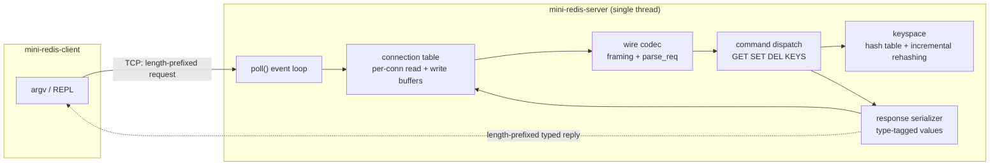
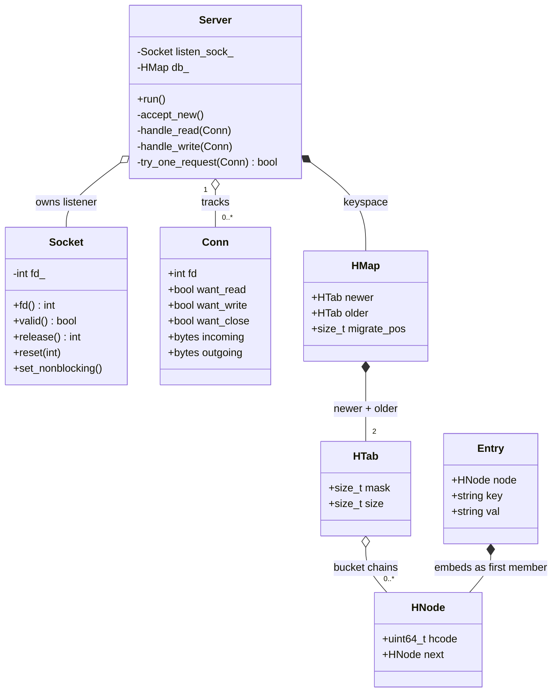
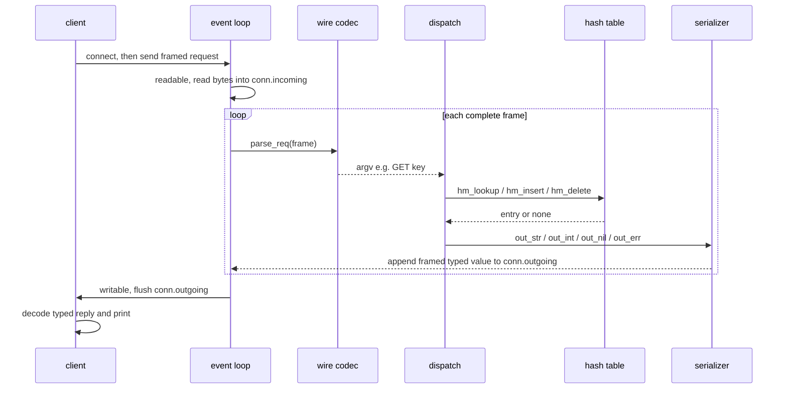
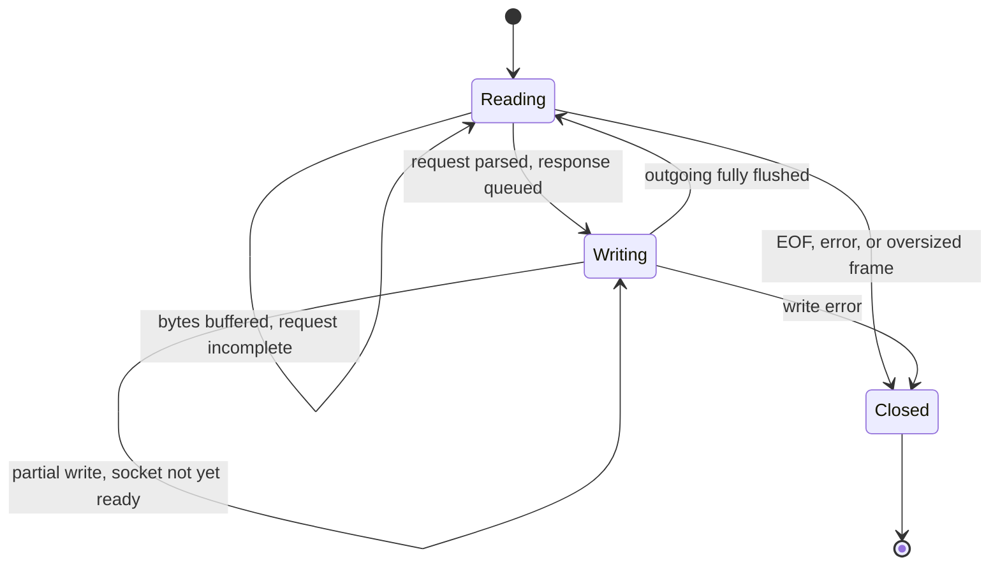
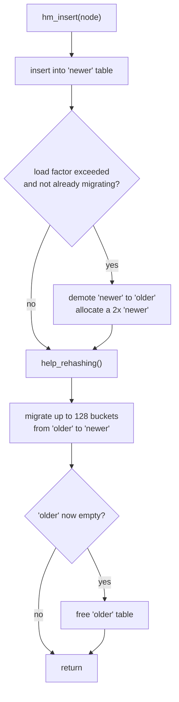

# mini-redis


An in-memory key–value store written from scratch in C++17. It pairs a
single-threaded, `poll()`-driven network server with a custom binary wire
protocol and a hand-written hash table that rehashes incrementally, so a
growing keyspace never causes a latency spike.

It is not a wrapper around existing libraries: the socket layer, the wire
format, the response serializer, and the storage engine are all implemented
directly.

```text
$ ./build/mini-redis-server 6379 &
$ ./build/mini-redis-client set user:1 alice
(nil)
$ ./build/mini-redis-client get user:1
"alice"
$ ./build/mini-redis-client del user:1
(integer) 1
$ ./build/mini-redis-client keys
(array of 0)
```

---

## Contents

- [At a glance](#at-a-glance)
- [System architecture](#system-architecture)
- [Component internals](#component-internals)
- [Class model (UML)](#class-model-uml)
- [Execution flow](#execution-flow)
  - [Request/response lifecycle](#requestresponse-lifecycle)
  - [Connection state machine](#connection-state-machine)
  - [Incremental rehashing](#incremental-rehashing)
- [Wire protocol](#wire-protocol)
- [Commands](#commands)
- [Build, run, test](#build-run-test)
- [Project layout](#project-layout)
- [Design decisions](#design-decisions)
- [Roadmap](#roadmap)

---

## At a glance

| Aspect | Choice |
|---|---|
| Concurrency model | Single thread, non-blocking sockets, one `poll()` event loop |
| Transport | TCP, length-prefixed binary framing |
| Request encoding | `[u32 nstr] ([u32 len][bytes])*` |
| Response encoding | Type-tagged value (nil / string / int / double / error / array) |
| Keyspace | Custom intrusive hash table with incremental rehashing |
| Commands | `GET`, `SET`, `DEL`, `KEYS` |
| Pipelining | Yes — every complete request buffered from one read is served |
| Tests | 25 unit tests (Catch2 + CTest) |
| Build | CMake; server, client and tests share one static library |

A deeper, forward-looking design document lives in
[`docs/architecture.md`](docs/architecture.md).

---

## System architecture

The server is organized as a thin stack of layers. A byte stream enters at the
event loop, is framed and parsed into a command, dispatched against the
keyspace, and the result is serialized back into the connection's outgoing
buffer.



Seen through the usual database decomposition:

| Layer | In mini-redis |
|---|---|
| **Transport** | `poll()` loop, non-blocking sockets, framing, buffered I/O |
| **Query processing** | Command lookup + argument/arity validation (no query language, so this stays thin) |
| **Execution** | Command handlers run directly against the store; the single thread gives per-command atomicity with no locks |
| **Storage** | Hash-table keyspace with incremental rehashing |

---

## Component internals

### Networking (`net/`)
- **`Socket`** — a move-only RAII wrapper that owns a file descriptor and closes
  it on destruction, so listener and client fds cannot leak or be double-closed.
  It also exposes `set_nonblocking()` (via `fcntl`), which every socket in the
  event loop uses.
- **`read_full` / `write_all`** — loop over `read()`/`write()` until the exact
  requested byte count has been transferred, hiding short reads and writes. The
  client uses these for its simple blocking round-trips.

### Wire codec (`protocol/wire.*`)
- **Framing** — every message is a 4-byte little-endian length followed by that
  many payload bytes, capped at `MAX_MSG` (32 KiB) so a single client cannot
  force an unbounded allocation.
- **`parse_req`** — decodes a request payload `[u32 nstr]([u32 len][bytes])*`
  into a vector of argument strings. It validates lengths against the buffer and
  rejects truncated or trailing-garbage input instead of over-reading — the
  behavior the parser edge-case tests pin down.

### Response serialization (`protocol/serialize.*`)
Replies are encoded as a single **type-tagged value** so the client never has to
guess what it received:

| Tag | Type | Encoding after the tag byte |
|----:|------|-----------------------------|
| 0 | nil | — |
| 1 | error | `[u32 code][u32 len][msg]` |
| 2 | string | `[u32 len][bytes]` |
| 3 | int64 | `[i64]` |
| 4 | double | `[f64]` |
| 5 | array | `[u32 count]` then `count` nested values |

Arrays nest, which is what commands returning collections (`KEYS`, and sorted-set
ranges later) rely on.

### Storage engine (`store/`)
- **`HNode` / `HTab` / `HMap`** — an intrusive, open-chained hash table. The node
  (`HNode`) is embedded as the first member of each `Entry` and recovered with
  `container_of`, so there is one allocation per entry and good cache locality.
- **Incremental rehashing** — an `HMap` holds two tables, `newer` and `older`.
  When the load factor is exceeded, the current table is demoted to `older`, a
  table of twice the size becomes `newer`, and every subsequent operation
  migrates a bounded number of buckets (128) from `older` to `newer`. Growth is
  therefore spread across many operations instead of one `O(n)` stop-the-world
  resize. Lookups consult **both** tables while a migration is in flight.
- **`Entry`** — a key/value pair (both strings today) carrying the intrusive node.

### Server / event loop (`server/`)
- **`Conn`** — one connection: its fd, intent flags (`want_read` / `want_write` /
  `want_close`), and its own `incoming` / `outgoing` byte buffers.
- **`Server::run`** — builds a `pollfd` set (the listener plus every connection),
  calls `poll()`, accepts new connections, and drives readable/writable ones.
- **`try_one_request`** — pulls one complete frame from `incoming`, parses and
  dispatches it, and appends the framed, serialized reply to `outgoing`.
  `handle_read` calls it in a loop, so several requests received in one read are
  processed back to back (**pipelining**).
- **Command dispatch** — `do_request` upper-cases the verb and routes to
  `GET` / `SET` / `DEL` / `KEYS`, writing a typed value into the response buffer.

### Client (`client/`)
Sends a command either from `argv` (one-shot) or interactively, encodes it in the
request framing, and pretty-prints the typed reply — strings quoted, integers and
errors labelled, array elements indented.

---

## Class model (UML)



---

## Execution flow

### Request/response lifecycle



### Connection state machine

Each `Conn` alternates between reading requests and flushing the response
buffer; back-pressure keeps the server from reading faster than it can write.



### Incremental rehashing

A resize is triggered lazily and then advanced a little on each operation, rather
than all at once — which is why the table never stalls.



`hm_lookup` and `hm_delete` run the same `help_rehashing` step and then search
`newer` first, falling back to `older`, so no key is ever lost mid-migration.

---

## Wire protocol

All integers are little-endian.

**Request**

```text
frame    = u32 length , payload           # length <= 32768 (MAX_MSG)
payload  = u32 nstr , argument{nstr}
argument = u32 len , byte{len}
```

Example — `SET user:1 alice`:

```text
nstr = 3
"SET"     -> 03 00 00 00 | 53 45 54
"user:1"  -> 06 00 00 00 | 75 73 65 72 3a 31
"alice"   -> 05 00 00 00 | 61 6c 69 63 65
```

**Response**

```text
frame = u32 length , value
value = tag , body        # tag/body per the serialization table above
```

---

## Commands

| Command | Arguments | Reply |
|---|---|---|
| `GET`  | `key`         | string, or nil if absent |
| `SET`  | `key value`   | nil |
| `DEL`  | `key`         | integer (1 if removed, else 0) |
| `KEYS` | —             | array of all keys |

Unknown verbs and malformed frames return a typed error.

---

## Build, run, test

Requires CMake ≥ 3.20 and a C++17 compiler. Catch2 is fetched automatically.

```bash
cmake -B build
cmake --build build -j

# start the server (default port 6379)
./build/mini-redis-server 6379 &

# one-shot commands
./build/mini-redis-client set greeting hello
./build/mini-redis-client get greeting        # -> "hello"

# or an interactive session
./build/mini-redis-client
> set a 1
> keys
> exit
```

Run the test suite:

```bash
ctest --test-dir build --output-on-failure
```

The 25 tests cover socket fd ownership and move semantics, the wire codec and
framing, `parse_req` on malformed and truncated input, hash-table
insert/lookup/delete including a one-million-key rehash-survival run, and the
byte layout of the response serializer.

---

## Project layout

```text
mini-redis/
├── CMakeLists.txt              # builds a shared mini-redis-core static lib
├── include/
│   ├── common/                 # log helpers, container_of
│   ├── net/                    # Socket, read_full/write_all
│   ├── protocol/               # wire framing/parser, response serializer
│   ├── server/                 # Conn, Server, command dispatch
│   └── store/                  # hash table, Entry
├── src/                        # implementations mirroring include/
├── client/                     # command-line client
├── tests/unit/                 # Catch2 unit tests
└── docs/architecture.md        # extended design document
```

---

## Design decisions

- **`poll()` over `epoll`/`kqueue`.** Portable across Linux and macOS and more
  than sufficient at this scale; the poller is isolated so a platform-specific
  backend could be added behind it later.
- **A custom intrusive hash table instead of `std::unordered_map`.** It enables
  incremental rehashing (no `O(n)` resize pause), keeps one allocation per entry,
  and gives full control over layout and iteration.
- **Single-threaded execution.** Commands run to completion on one thread, so
  each is atomic by construction — no locks, latches, or races on the keyspace.
- **A compact binary protocol.** Fixed-width lengths and type tags make framing
  and parsing trivial and allocation-bounded, and let the client render replies
  without guessing types.

---

## Roadmap

Implemented today: the networking stack, wire protocol, response serialization,
the hash-table keyspace with incremental rehashing, and `GET`/`SET`/`DEL`/`KEYS`.

Planned next:

- Sorted set backed by a balanced BST for `O(log n)` ranked range queries
- Additional value types (list, hash, set)
- Per-key TTL with a timer, and approximate LRU eviction
- Durability: append-only log and point-in-time snapshots
- Publish/subscribe
- Throughput and latency benchmarks against real Redis
