# mini-redis


[](https://github.com/Rohitangshu2026/mini-redis/actions/workflows/ci.yml)

An in-memory key-value store written from scratch in C++17.

A single thread runs a `poll()` event loop over non-blocking TCP sockets,
speaks a compact length-prefixed binary protocol, and executes every command
against data structures written by hand for this project: an intrusive hash
table that grows without ever pausing, an AVL tree with rank queries behind a
sorted set, a linked list that tracks idle connections, and a min-heap of key
expirations. A small thread pool frees very large values away from the event
loop. The only dependencies are the C++ standard library and POSIX sockets
(plus Catch2 for the tests).

```text
$ ./build/mini-redis-server &
Server listening on port 6379
$ ./build/mini-redis-client set user:1 alice
(nil)
$ ./build/mini-redis-client get user:1
"alice"
$ ./build/mini-redis-client pexpire user:1 5000
(integer) 1
$ ./build/mini-redis-client pttl user:1
(integer) 4997
$ ./build/mini-redis-client zadd board 1.5 alice
(integer) 1
$ ./build/mini-redis-client zadd board 2 bob
(integer) 1
$ ./build/mini-redis-client zquery board 0 "" 0 10
(array of 4)
  "alice"
  (double) 1.5
  "bob"
  (double) 2
$ ./build/mini-redis-client get board
(error 3) WRONGTYPE Operation against a key holding the wrong kind of value
```

---

## Contents

- [At a glance](#at-a-glance)
- [Architecture](#architecture)
- [Networking](#networking)
  - [Sockets and file descriptors](#sockets-and-file-descriptors)
  - [Server startup](#server-startup)
  - [Accepting a connection](#accepting-a-connection)
  - [The client side](#the-client-side)
- [Life of a request](#life-of-a-request)
  - [End to end: one SET](#end-to-end-one-set)
  - [TCP is a byte stream](#tcp-is-a-byte-stream)
  - [Why every connection has its own buffers](#why-every-connection-has-its-own-buffers)
  - [Pipelining](#pipelining)
  - [Back-pressure and the connection state machine](#back-pressure-and-the-connection-state-machine)
  - [Many clients, one thread](#many-clients-one-thread)
- [Concurrency model](#concurrency-model)
- [Wire protocol](#wire-protocol)
- [Reply serialization](#reply-serialization)
- [Storage engine](#storage-engine)
  - [Intrusive data structures](#intrusive-data-structures)
  - [The hash table](#the-hash-table)
  - [Incremental rehashing](#incremental-rehashing)
  - [Entries and the command paths](#entries-and-the-command-paths)
- [Sorted sets](#sorted-sets)
  - [Two indexes, one allocation](#two-indexes-one-allocation)
  - [AVL tree with subtree counts](#avl-tree-with-subtree-counts)
  - [Rank queries](#rank-queries)
  - [ZADD and ZQUERY](#zadd-and-zquery)
- [Timers and expiration](#timers-and-expiration)
  - [One timeout for poll()](#one-timeout-for-poll)
  - [Idle connections](#idle-connections)
  - [Key expiration on a min-heap](#key-expiration-on-a-min-heap)
  - [Lazy and active expiry](#lazy-and-active-expiry)
- [Thread pool](#thread-pool)
- [Class model (UML)](#class-model-uml)
- [Commands](#commands)
- [Build, run, test](#build-run-test)
- [Project layout](#project-layout)
- [Design decisions and trade-offs](#design-decisions-and-trade-offs)
- [Roadmap](#roadmap)

---

## At a glance

| Aspect | Choice |
|---|---|
| Language and build | C++17, CMake; server, client and tests link one static library |
| Concurrency | One event-loop thread does all I/O and executes every command; 4 worker threads exist only to free large values |
| Transport | TCP, non-blocking sockets, `poll()` readiness, request pipelining, back-pressure |
| Protocol | Binary, length-prefixed frames (max 32 KiB); replies are type-tagged values |
| Keyspace | Intrusive chained hash table with incremental rehashing |
| Value types | Strings and sorted sets |
| Sorted set | Hash index by member + AVL tree by `(score, member)` with subtree counts: `O(log n)` insert, delete, seek and rank offset |
| Idle connections | Closed after 30 s without activity (configurable), tracked on an intrusive doubly-linked list |
| Expiration | Per-key TTL on a binary min-heap, lazy + active expiry |
| Commands | `GET` `SET` `DEL` `KEYS` · `EXPIRE` `PEXPIRE` `TTL` `PTTL` `PERSIST` · `ZADD` `ZREM` `ZSCORE` `ZQUERY` |
| Tests | Catch2 through CTest; hash table, AVL tree, sorted set and heap are property-tested against reference models |
| CI | GitHub Actions: Linux + macOS, gcc + clang, Debug + Release, ASan/UBSan, TSan |

---

## Architecture

The server is a single process. The kernel owns the sockets and all TCP state;
the event loop asks the kernel which sockets are ready, moves bytes between
kernel buffers and per-connection buffers, and runs each complete command
against the keyspace. Everything that touches data happens on that one thread.

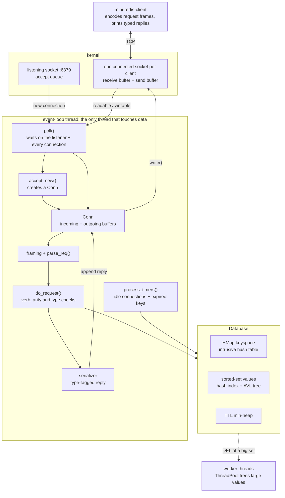
```mermaid
flowchart TB
    CLI["mini-redis-client<br/>encodes request frames, prints typed replies"]

    subgraph KER["kernel"]
        direction LR
        LSK["listening socket :6379<br/>accept queue"]
        CSK["one connected socket per client<br/>receive buffer + send buffer"]
    end

    subgraph EVT["event-loop thread: the only thread that touches data"]
        direction TB
        PL["poll()<br/>waits on the listener + every connection"]
        AC["accept_new()<br/>creates a Conn"]
        CN["Conn<br/>incoming + outgoing buffers"]
        FR["framing + parse_req()"]
        DP["do_request()<br/>verb, arity and type checks"]
        SR["serializer<br/>type-tagged reply"]
        TM["process_timers()<br/>idle connections + expired keys"]
    end

    subgraph DBS["Database"]
        direction LR
        HM["HMap keyspace<br/>intrusive hash table"]
        ZS["sorted-set values<br/>hash index + AVL tree"]
        HP["TTL min-heap"]
    end

    TP["worker threads<br/>ThreadPool frees large values"]

    CLI <-->|"TCP"| CSK
    LSK -->|"new connection"| PL
    CSK -->|"readable / writable"| PL
    PL --> AC --> CN
    PL --> CN
    CN --> FR --> DP --> SR
    SR -->|"append reply"| CN
    CN -->|"write()"| CSK
    DP --> DBS
    TM --> DBS
    DBS -.->|"DEL of a big set"| TP
```

Seen as the usual layers of a database:

| Layer | In mini-redis |
|---|---|
| Transport | `poll()` loop, non-blocking sockets, framing, per-connection buffers |
| Query processing | Verb lookup plus arity and argument validation (there is no query language, so this stays thin) |
| Execution | Command handlers run directly against the store; the single thread makes every command atomic without locks |
| Storage | Hash-table keyspace with incremental rehashing, sorted sets, TTL heap |

What keeps it fast is a handful of choices that reinforce each other:

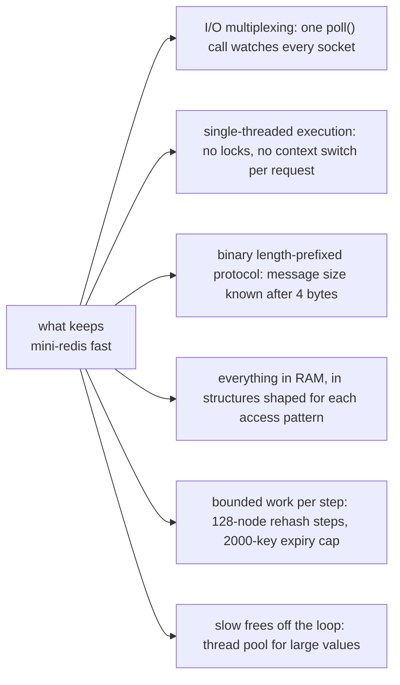
```mermaid
flowchart LR
    F["what keeps<br/>mini-redis fast"] --> A["I/O multiplexing: one poll() call watches every socket"]
    F --> B["single-threaded execution: no locks, no context switch per request"]
    F --> C["binary length-prefixed protocol: message size known after 4 bytes"]
    F --> D["everything in RAM, in structures shaped for each access pattern"]
    F --> E["bounded work per step: 128-node rehash steps, 2000-key expiry cap"]
    F --> G["slow frees off the loop: thread pool for large values"]
```

---

## Networking

### Sockets and file descriptors

To the kernel, a TCP socket is an object that holds a local address and port,
a remote address and port, the protocol, the connection state, and two byte
queues: a **receive buffer** (bytes that arrived from the network and have not
been read yet) and a **send buffer** (bytes the program wrote that the peer has
not acknowledged yet). A process never touches that object directly. It holds a
small integer, the **file descriptor**, that refers to it, and every socket call
(`bind`, `listen`, `accept`, `read`, `write`, `poll`) takes that fd.

The server uses two kinds of socket:

- one **listening socket**, which never carries data and only produces new
  connections, and
- one **connected socket per client**, which carries that client's bytes.

### Server startup

`main()` parses `[port] [idle_timeout_ms]` (defaults 6379 and 30000) and
constructs the `Server`, which sets up the listener before handing control to
the event loop.

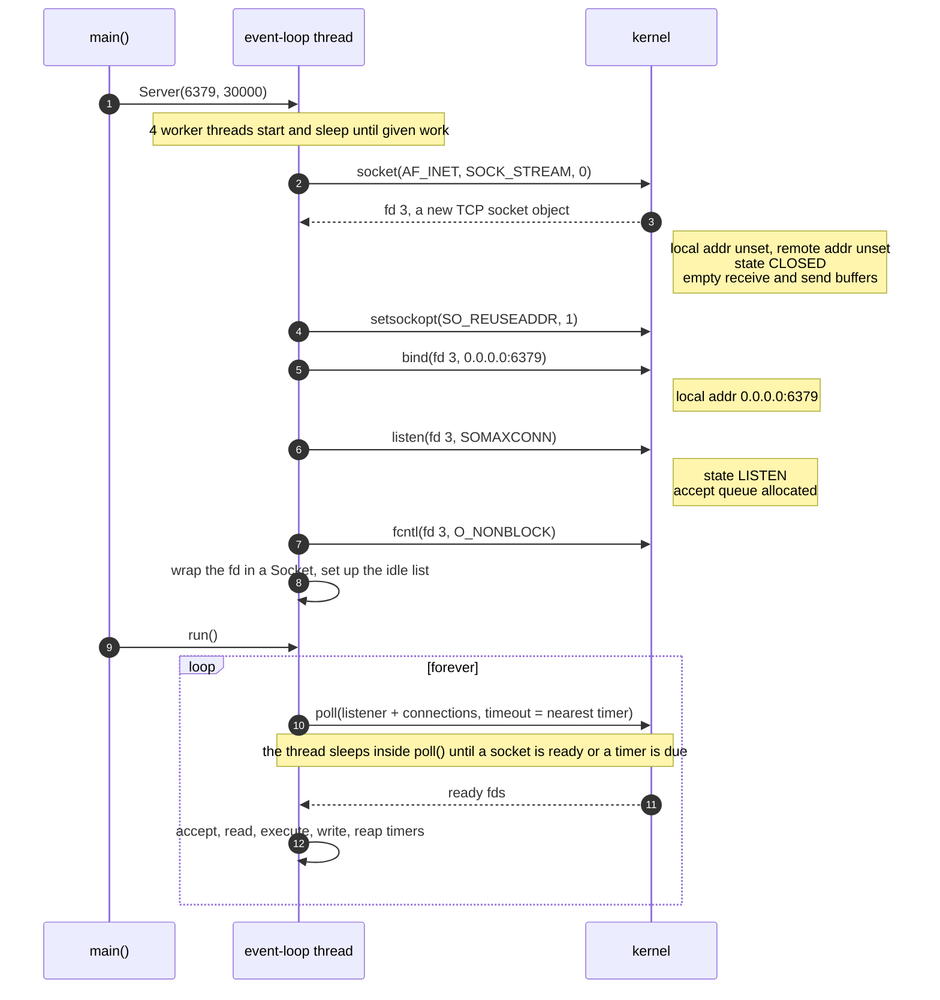
```mermaid
sequenceDiagram
    autonumber
    participant M as main()
    participant S as event-loop thread
    participant K as kernel
    M->>S: Server(6379, 30000)
    Note over S: 4 worker threads start and sleep until given work
    S->>K: socket(AF_INET, SOCK_STREAM, 0)
    K-->>S: fd 3, a new TCP socket object
    Note right of K: local addr unset, remote addr unset<br/>state CLOSED<br/>empty receive and send buffers
    S->>K: setsockopt(SO_REUSEADDR, 1)
    S->>K: bind(fd 3, 0.0.0.0:6379)
    Note right of K: local addr 0.0.0.0:6379
    S->>K: listen(fd 3, SOMAXCONN)
    Note right of K: state LISTEN<br/>accept queue allocated
    S->>K: fcntl(fd 3, O_NONBLOCK)
    S->>S: wrap the fd in a Socket, set up the idle list
    M->>S: run()
    loop forever
        S->>K: poll(listener + connections, timeout = nearest timer)
        Note over S,K: the thread sleeps inside poll() until a socket is ready or a timer is due
        K-->>S: ready fds
        S->>S: accept, read, execute, write, reap timers
    end
```

What each step buys:

- **`SO_REUSEADDR`** lets a restarted server bind 6379 immediately, even while
  connections from the previous run are still in `TIME_WAIT`.
- **`0.0.0.0` (`INADDR_ANY`)** listens on every interface.
- **`listen(fd, SOMAXCONN)`** turns the socket into a listener and sizes its
  **accept queue**, the line of fully-established connections waiting for
  `accept()`. The kernel caps the number at its own limit
  (`net.core.somaxconn` on Linux).
- **`O_NONBLOCK`** makes `accept()` on an empty queue return `EAGAIN` instead
  of freezing the thread. Every socket the loop touches is non-blocking.
- **`Socket`** is a move-only RAII wrapper: it owns the fd, closes it exactly
  once in its destructor, and cannot be copied, so descriptors can't leak or be
  double-closed.

### Accepting a connection

The TCP three-way handshake is handled entirely by the kernel. The server never
sees a `SYN` or an `ACK`; it only finds a finished connection waiting in the
accept queue.

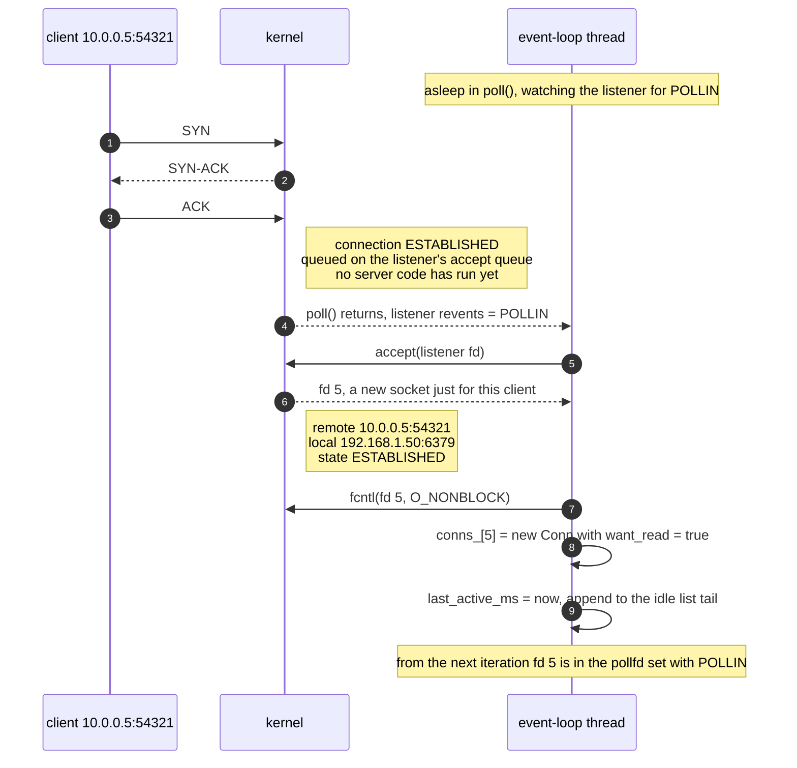
```mermaid
sequenceDiagram
    autonumber
    participant C as client 10.0.0.5:54321
    participant K as kernel
    participant S as event-loop thread
    Note over S: asleep in poll(), watching the listener for POLLIN
    C->>K: SYN
    K-->>C: SYN-ACK
    C->>K: ACK
    Note right of K: connection ESTABLISHED<br/>queued on the listener's accept queue<br/>no server code has run yet
    K-->>S: poll() returns, listener revents = POLLIN
    S->>K: accept(listener fd)
    K-->>S: fd 5, a new socket just for this client
    Note right of K: remote 10.0.0.5:54321<br/>local 192.168.1.50:6379<br/>state ESTABLISHED
    S->>K: fcntl(fd 5, O_NONBLOCK)
    S->>S: conns_[5] = new Conn with want_read = true
    S->>S: last_active_ms = now, append to the idle list tail
    Note over S: from the next iteration fd 5 is in the pollfd set with POLLIN
```

- "The listener is readable" means exactly "the accept queue is not empty".
- `accept()` returns a brand-new fd for that one client. The listening socket
  stays open and keeps listening.
- `accept_new()` takes one connection per wakeup. `poll()` is level-triggered,
  so if more connections are queued the listener is still readable on the next
  pass and they are picked up immediately.
- `conns_` is a vector indexed by fd, so going from a ready fd to its `Conn` is
  a single array access.
- `poll()` has no separate "add to the watch list" call (the role
  `epoll_ctl(ADD)` plays with epoll). The `pollfd` array is rebuilt from
  `conns_` on every iteration, so a new connection is watched from the next
  pass on.

### The client side

`mini-redis-client` is deliberately simple and blocking. It sends one request
and waits for exactly one reply, either once from `argv` or in a loop as a REPL.

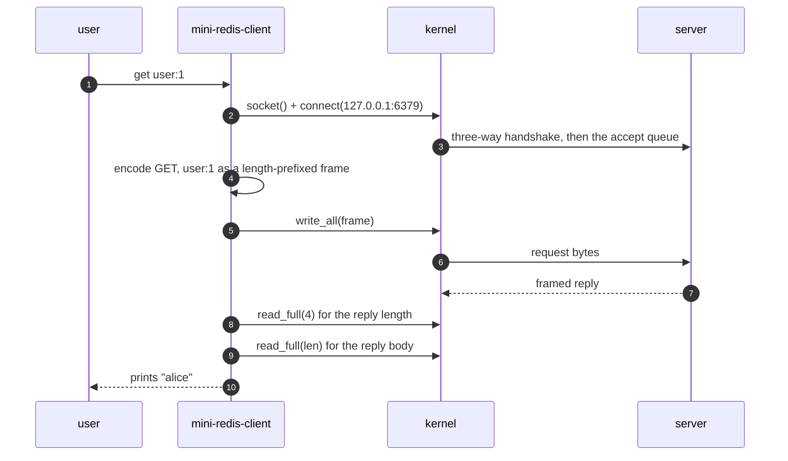
```mermaid
sequenceDiagram
    autonumber
    participant U as user
    participant C as mini-redis-client
    participant K as kernel
    participant S as server
    U->>C: get user:1
    C->>K: socket() + connect(127.0.0.1:6379)
    K->>S: three-way handshake, then the accept queue
    C->>C: encode GET, user:1 as a length-prefixed frame
    C->>K: write_all(frame)
    K->>S: request bytes
    S-->>K: framed reply
    C->>K: read_full(4) for the reply length
    C->>K: read_full(len) for the reply body
    C-->>U: prints "alice"
```

A single `read()` or `write()` may move fewer bytes than asked for.
`read_full` and `write_all` loop until the exact count has been transferred,
which is all a blocking client needs. The server can't use that approach,
because it must never wait on one client; that is what the event loop solves.

---

## Life of a request

### End to end: one SET

This follows `SET user:1 alice` from the client's `write()` to the reply, on a
connection that is already established.

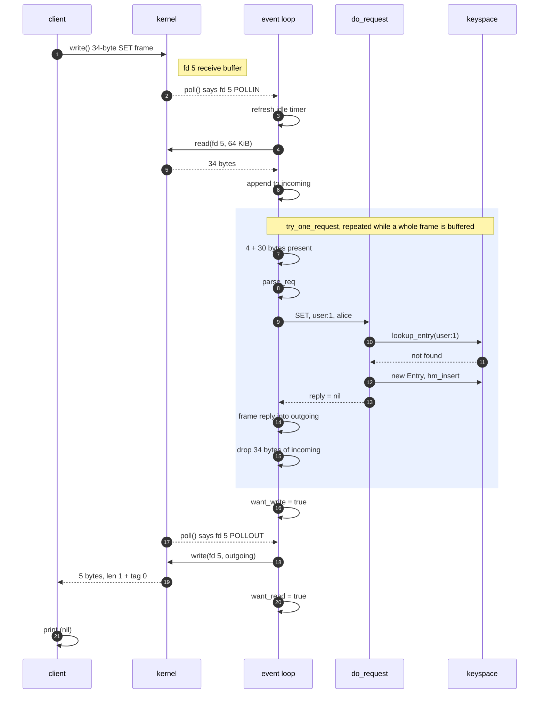
```mermaid
sequenceDiagram
    autonumber
    participant C as client
    participant K as kernel
    participant L as event loop
    participant D as do_request
    participant DB as keyspace

    C->>K: write() 34-byte SET frame
    Note right of K: fd 5 receive buffer
    K-->>L: poll() says fd 5 POLLIN
    L->>L: refresh idle timer
    L->>K: read(fd 5, 64 KiB)
    K-->>L: 34 bytes
    L->>L: append to incoming

    rect rgba(80, 140, 255, 0.12)
    Note over L,DB: try_one_request, repeated while a whole frame is buffered
    L->>L: 4 + 30 bytes present
    L->>L: parse_req
    L->>D: SET, user:1, alice
    D->>DB: lookup_entry(user:1)
    DB-->>D: not found
    D->>DB: new Entry, hm_insert
    D-->>L: reply = nil
    L->>L: frame reply into outgoing
    L->>L: drop 34 bytes of incoming
    end

    L->>L: want_write = true
    K-->>L: poll() says fd 5 POLLOUT
    L->>K: write(fd 5, outgoing)
    K-->>C: 5 bytes, len 1 + tag 0
    L->>L: want_read = true
    C->>C: print (nil)
```

1. **Wake up.** Bytes arriving in the kernel's receive buffer make fd 5
   readable, so `poll()` returns.
2. **Read.** `handle_read()` does one non-blocking `read()` of up to 64 KiB and
   appends whatever arrived to the connection's own `incoming` buffer.
3. **Frame and parse.** `try_one_request()` checks whether a whole frame is
   buffered, and if so `parse_req()` turns the payload into a list of argument
   strings.
4. **Execute.** `do_request()` upper-cases the verb, checks arity, and calls
   the handler, which reads or writes the keyspace and serializes exactly one
   typed reply.
5. **Queue the reply.** The reply gets its own 4-byte length prefix and is
   appended to `outgoing`; the consumed request bytes are dropped from
   `incoming`.
6. **Write.** The connection flips to writing; on the next pass `poll()`
   reports it writable and `handle_write()` hands `outgoing` to the kernel.

### TCP is a byte stream

TCP guarantees that bytes arrive in order, not that they arrive in the same
chunks they were sent in. A 34-byte frame can show up as 20 bytes and then 14;
three frames can show up in a single `read()`. The server handles both the same
way: bytes pile up in `conn.incoming`, and a request only runs once its entire
frame is present.

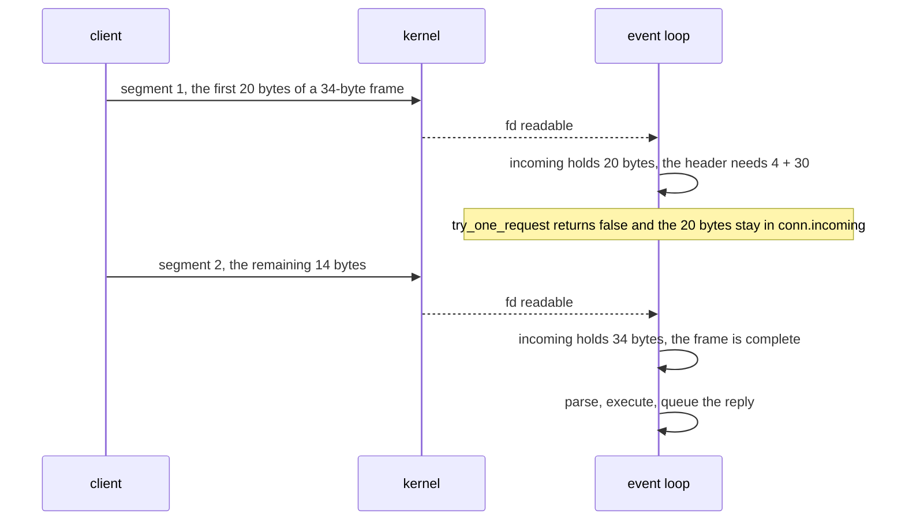
```mermaid
sequenceDiagram
    participant C as client
    participant K as kernel
    participant L as event loop
    C->>K: segment 1, the first 20 bytes of a 34-byte frame
    K-->>L: fd readable
    L->>L: incoming holds 20 bytes, the header needs 4 + 30
    Note over L: try_one_request returns false and the 20 bytes stay in conn.incoming
    C->>K: segment 2, the remaining 14 bytes
    K-->>L: fd readable
    L->>L: incoming holds 34 bytes, the frame is complete
    L->>L: parse, execute, queue the reply
```

`try_one_request()` is the whole decision:

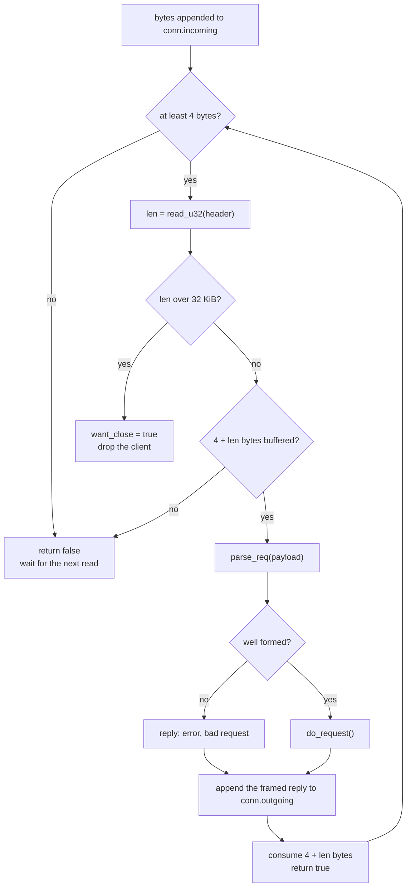
```mermaid
flowchart TD
    A["bytes appended to conn.incoming"] --> B{"at least 4 bytes?"}
    B -->|no| W["return false<br/>wait for the next read"]
    B -->|yes| C["len = read_u32(header)"]
    C --> D{"len over 32 KiB?"}
    D -->|yes| X["want_close = true<br/>drop the client"]
    D -->|no| E{"4 + len bytes buffered?"}
    E -->|no| W
    E -->|yes| F["parse_req(payload)"]
    F --> G{"well formed?"}
    G -->|no| H["reply: error, bad request"]
    G -->|yes| I["do_request()"]
    H --> J["append the framed reply to conn.outgoing"]
    I --> J
    J --> K["consume 4 + len bytes<br/>return true"]
    K --> B
```

The 32 KiB cap is checked before waiting for the body, so a client cannot make
the server buffer an unbounded amount of data by announcing a huge length.

### Why every connection has its own buffers

- **Partial frames need somewhere to wait.** Half a request can't be executed,
  and it can't be thrown away either.
- **Replies may not fit in one write.** If the kernel's send buffer is full,
  `write()` takes only part of the reply. The rest stays in `outgoing` until the
  socket is writable again.
- **Isolation.** A slow or stalled client only backs up its own buffers; every
  other connection keeps moving.

`incoming` and `outgoing` are the process-side counterparts of the kernel's
receive and send buffers. The kernel's buffers hold bytes on the network's
schedule; the connection's buffers hold them until the server is ready to act.

### Pipelining

A client doesn't have to wait for each reply before sending the next request.
`handle_read()` calls `try_one_request()` in a loop, so every complete frame
that arrived in one read is executed back to back, and the replies go out
together, in request order.

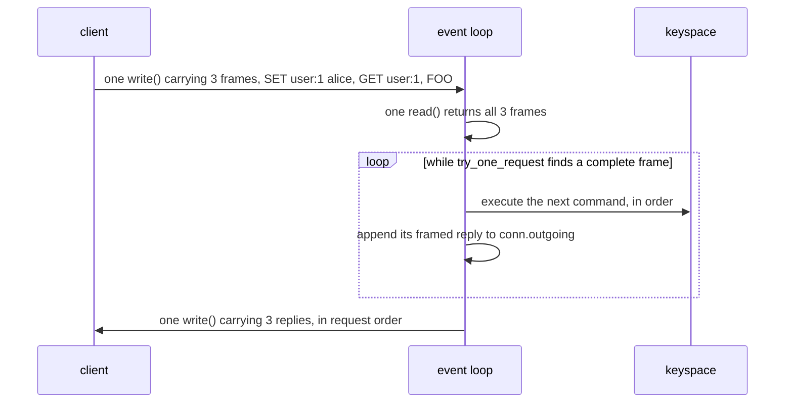
```mermaid
sequenceDiagram
    participant C as client
    participant L as event loop
    participant DB as keyspace
    C->>L: one write() carrying 3 frames, SET user:1 alice, GET user:1, FOO
    L->>L: one read() returns all 3 frames
    loop while try_one_request finds a complete frame
        L->>DB: execute the next command, in order
        L->>L: append its framed reply to conn.outgoing
    end
    L->>C: one write() carrying 3 replies, in request order
```

This saves one network round trip per command, and it is exactly what the
bytes in [Pipelined replies, captured](#pipelined-replies-captured) show.

### Back-pressure and the connection state machine

A connection is either reading or writing, never both. While it has unsent
replies, the server stops reading from it (`want_read = false`), so a client
that sends requests but never reads replies can't make the server buffer
without limit.

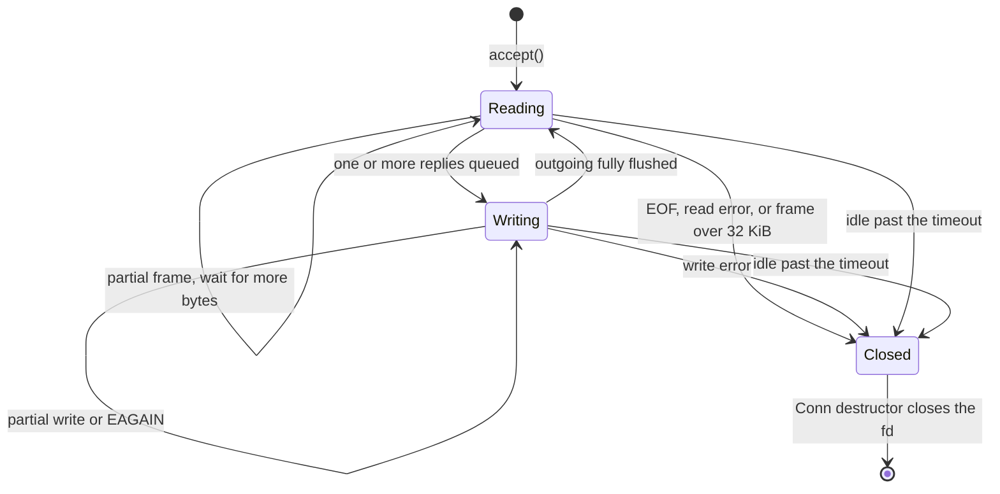
```mermaid
stateDiagram-v2
    [*] --> Reading: accept()
    Reading --> Reading: partial frame, wait for more bytes
    Reading --> Writing: one or more replies queued
    Writing --> Writing: partial write or EAGAIN
    Writing --> Reading: outgoing fully flushed
    Reading --> Closed: EOF, read error, or frame over 32 KiB
    Writing --> Closed: write error
    Reading --> Closed: idle past the timeout
    Writing --> Closed: idle past the timeout
    Closed --> [*]: Conn destructor closes the fd
```

The state lives in three flags on `Conn`: `want_read` and `want_write` decide
which events the connection asks `poll()` for, and `want_close` marks it for
teardown at the end of the current pass. `POLLERR` and `POLLHUP` also close it.

### Many clients, one thread

When several sockets are ready at once, `poll()` returns all of them and the
loop serves them one after another.

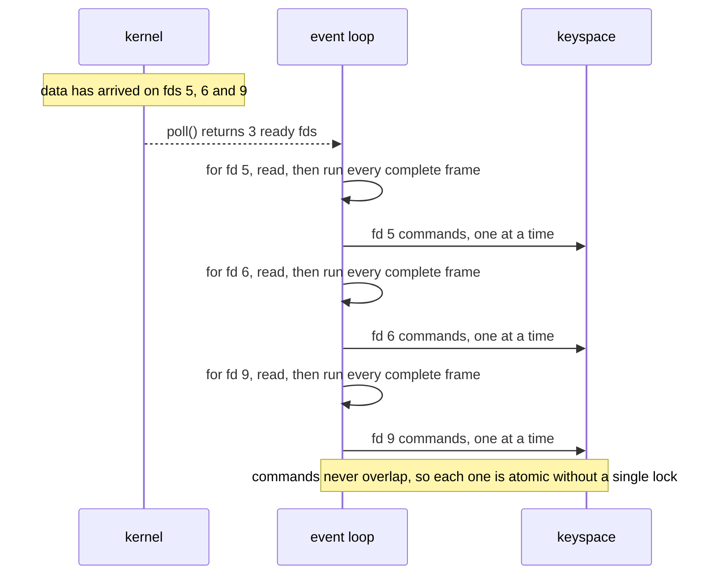
```mermaid
sequenceDiagram
    participant K as kernel
    participant L as event loop
    participant DB as keyspace
    Note over K: data has arrived on fds 5, 6 and 9
    K-->>L: poll() returns 3 ready fds
    L->>L: for fd 5, read, then run every complete frame
    L->>DB: fd 5 commands, one at a time
    L->>L: for fd 6, read, then run every complete frame
    L->>DB: fd 6 commands, one at a time
    L->>L: for fd 9, read, then run every complete frame
    L->>DB: fd 9 commands, one at a time
    Note over L,DB: commands never overlap, so each one is atomic without a single lock
```

Production Redis (6.0 and later) can optionally hand socket reads, writes and
parsing to I/O threads while still executing commands on the main thread.
mini-redis keeps all of it on one thread. The per-connection buffers are what
would make that split possible later: reading and parsing fill a connection's
buffer independently, and execution only ever consumes complete requests.

---

## Concurrency model

There are three classic ways to serve many clients:

| Model | How it waits | What it costs |
|---|---|---|
| Blocking, one client at a time | `read()` blocks on the current client | one slow client stalls everyone |
| Thread (or process) per connection | each thread blocks in its own `read()` | a stack per thread, context switches, locks around all shared data |
| **Readiness-based event loop** (mini-redis) | one `poll()` for every socket, then non-blocking `read()` / `write()` | a slow *command* stalls everyone, so every step must be short |

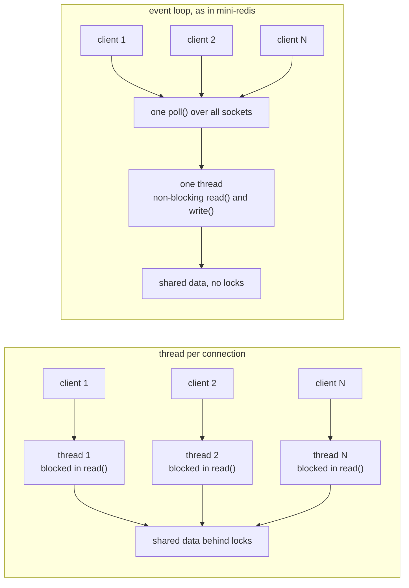
```mermaid
flowchart LR
    subgraph TPC["thread per connection"]
        direction TB
        c1["client 1"] --> t1["thread 1<br/>blocked in read()"]
        c2["client 2"] --> t2["thread 2<br/>blocked in read()"]
        c3["client N"] --> t3["thread N<br/>blocked in read()"]
        t1 --> lk["shared data behind locks"]
        t2 --> lk
        t3 --> lk
    end
    subgraph EVL["event loop, as in mini-redis"]
        direction TB
        d1["client 1"] --> pl["one poll() over all sockets"]
        d2["client 2"] --> pl
        d3["client N"] --> pl
        pl --> one["one thread<br/>non-blocking read() and write()"]
        one --> nl["shared data, no locks"]
    end
```

The cost in the last row shapes the rest of the design. Anything that could
take long is broken into bounded pieces or moved off the loop: the hash table
resizes 128 nodes at a time, expiry reaps at most 2000 keys per pass, and large
values are freed by worker threads.

One iteration of `Server::run()`:

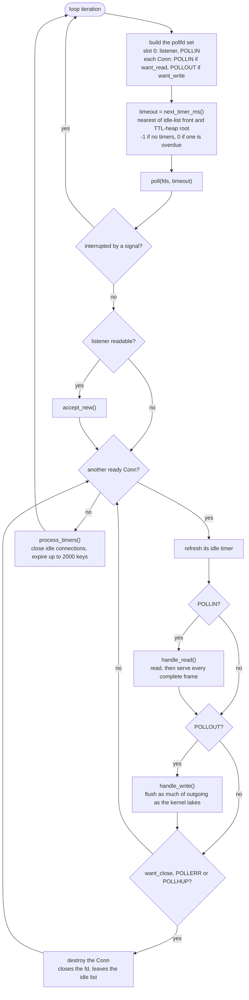
```mermaid
flowchart TD
    ST(["loop iteration"]) --> BL["build the pollfd set<br/>slot 0: listener, POLLIN<br/>each Conn: POLLIN if want_read, POLLOUT if want_write"]
    BL --> TO["timeout = next_timer_ms()<br/>nearest of idle-list front and TTL-heap root<br/>-1 if no timers, 0 if one is overdue"]
    TO --> PO["poll(fds, timeout)"]
    PO --> SG{"interrupted by a signal?"}
    SG -->|yes| ST
    SG -->|no| LS{"listener readable?"}
    LS -->|yes| AC["accept_new()"]
    LS -->|no| RC
    AC --> RC{"another ready Conn?"}
    RC -->|yes| TI["refresh its idle timer"]
    TI --> RD{"POLLIN?"}
    RD -->|yes| HR["handle_read()<br/>read, then serve every complete frame"]
    RD -->|no| WR
    HR --> WR{"POLLOUT?"}
    WR -->|yes| HW["handle_write()<br/>flush as much of outgoing as the kernel takes"]
    WR -->|no| CL
    HW --> CL{"want_close, POLLERR or POLLHUP?"}
    CL -->|yes| DC["destroy the Conn<br/>closes the fd, leaves the idle list"]
    CL -->|no| RC
    DC --> RC
    RC -->|no| PT["process_timers()<br/>close idle connections, expire up to 2000 keys"]
    PT --> ST
```

**Why `poll()` and not `epoll` or `kqueue`.** `poll()` works unchanged on
Linux and macOS, and at this scale it is plenty. Its cost is linear: the fd
array is rebuilt and scanned on every call. `epoll` (Linux) and `kqueue`
(BSD/macOS) keep the interest list inside the kernel and return only the ready
fds, which matters with tens of thousands of mostly idle connections. The poll
step is confined to `Server::run()`, so another backend could replace it
without touching the rest of the server.

---

## Wire protocol

Every message in both directions is a frame: a 4-byte little-endian length,
then that many payload bytes. The receiver knows the size of a message after
reading 4 bytes, so it never has to scan for delimiters.

```text
frame    = u32 length , payload          length <= 32768 (MAX_MSG)
request  = u32 nstr , argument * nstr    nstr   <= 200000
argument = u32 len , byte * len
reply    = one serialized value          see Reply serialization
```

### A request on the wire (captured)

The exact bytes the client sends for `SET user:1 alice`:

```text
1e 00 00 00                        frame length = 30
03 00 00 00                        nstr = 3
03 00 00 00  53 45 54              len 3, "SET"
06 00 00 00  75 73 65 72 3a 31     len 6, "user:1"
05 00 00 00  61 6c 69 63 65        len 5, "alice"
```

### Pipelined replies (captured)

Three requests (`SET user:1 alice`, `GET user:1`, `FOO`) sent in a single
`write()` come back as three frames in a single `read()`:

```text
01 00 00 00  00                                     len 1:  nil
0a 00 00 00  02  05 00 00 00  61 6c 69 63 65        len 10: str, len 5, "alice"
18 00 00 00  01  01 00 00 00  0f 00 00 00  75 6e 6b 6e 6f 77 6e 20 63 6f 6d 6d 61 6e 64
                                                    len 24: err, code 1, len 15, "unknown command"
```

### Compared with RESP

Real Redis speaks RESP, a text protocol. The same request in RESP is
`*3\r\n$3\r\nSET\r\n$6\r\nuser:1\r\n$5\r\nalice\r\n`.

| | RESP (Redis) | mini-redis |
|---|---|---|
| Encoding | Text: `*` array count, `$` string length, `\r\n` after each piece | Binary: 4-byte little-endian lengths |
| Finding the end of a message | Parse decimal counts and walk `\r\n` terminators | Read 4 bytes, then the exact size is known |
| Reply types | First byte `+` `-` `:` `$` `*` | First byte is a tag, 0 to 5 |
| Partial messages | Buffered until complete | Buffered until complete |
| Readable with `telnet` | Yes | No, it needs the client |

Both solve the same problem, marking where one piece ends and the next begins
in a byte stream. The binary form makes that check a single comparison, at the
cost of not being human-readable. A RESP front end is on the roadmap so that
`redis-cli` could talk to the server.

### Parser safety

`parse_req()` treats every length as untrusted. It checks each one against the
end of the buffer before reading, rejects argument counts above 200,000 before
allocating anything, and rejects frames with trailing bytes after the last
argument. A malformed frame gets an error reply; a frame longer than 32 KiB
closes the connection. The parser tests cover truncated headers, missing
bodies, lengths running past the end, trailing garbage and absurd counts.

---

## Reply serialization

Every reply is exactly one **type-tagged value**, so the client never has to
guess what it received.

| Tag | Type | Bytes after the tag | Used by |
|----:|---|---|---|
| 0 | nil | none | `GET` of a missing key, `SET`, `ZSCORE` of a missing member |
| 1 | error | `[u32 code][u32 len][msg]` | unknown verb (1), bad argument (2), `WRONGTYPE` (3) |
| 2 | string | `[u32 len][bytes]` | `GET`, `KEYS`, `ZQUERY` members |
| 3 | int64 | `[i64]` | `DEL`, `EXPIRE`, `TTL`, `ZADD`, `ZREM` |
| 4 | double | `[f64]` | `ZSCORE`, `ZQUERY` scores |
| 5 | array | `[u32 count]` then `count` values | `KEYS`, `ZQUERY` |

Arrays hold other values, including other arrays. A `ZQUERY` reply is an
array of alternating members and scores:

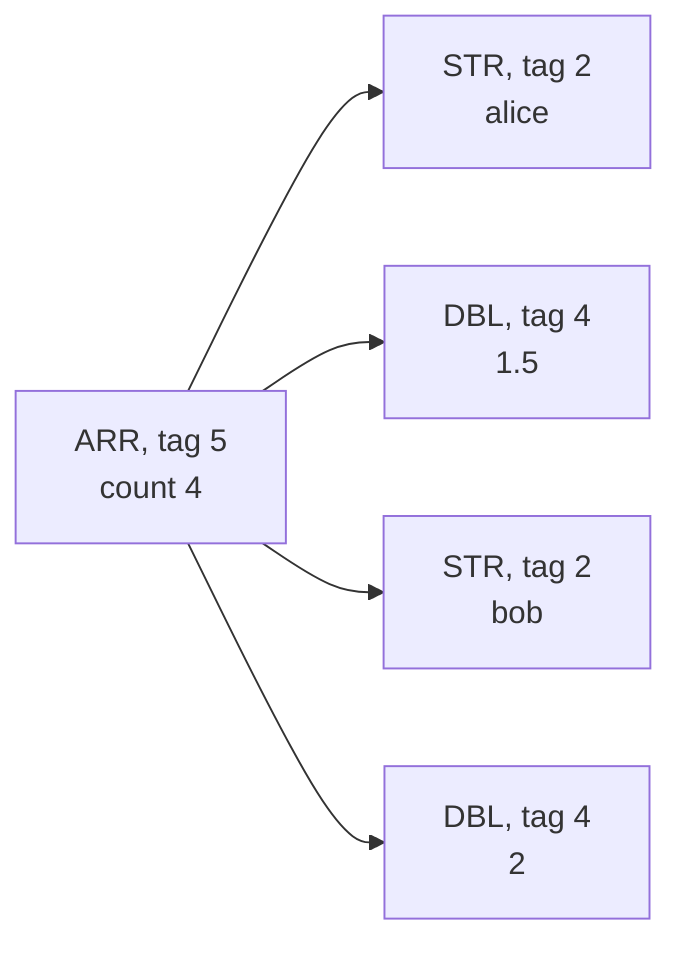
```mermaid
flowchart LR
    A["ARR, tag 5<br/>count 4"] --> B["STR, tag 2<br/>alice"]
    A --> C["DBL, tag 4<br/>1.5"]
    A --> D["STR, tag 2<br/>bob"]
    A --> E["DBL, tag 4<br/>2"]
```

`ZQUERY` doesn't know how many elements it will emit until it has walked the
tree, so it writes the array header first with a placeholder count and patches
it at the end:

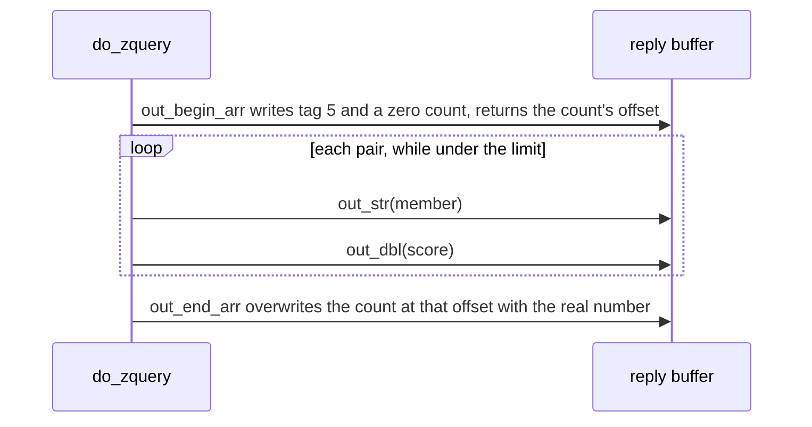
```mermaid
sequenceDiagram
    participant Q as do_zquery
    participant B as reply buffer
    Q->>B: out_begin_arr writes tag 5 and a zero count, returns the count's offset
    loop each pair, while under the limit
        Q->>B: out_str(member)
        Q->>B: out_dbl(score)
    end
    Q->>B: out_end_arr overwrites the count at that offset with the real number
```

This avoids a second pass or a temporary list. `KEYS` knows its count up front
(`hm_size`), so it writes the header directly.

---

## Storage engine

### Intrusive data structures

A standard container owns its elements: `std::unordered_map<std::string, Value>`
allocates a node that wraps each value. mini-redis turns that around. The
**data owns the link**: each record embeds a small hook struct, and the
container only ever sees hooks.

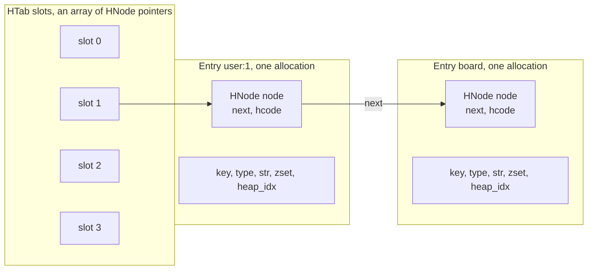
```mermaid
flowchart LR
    subgraph TAB["HTab slots, an array of HNode pointers"]
        direction TB
        S0["slot 0"]
        S1["slot 1"]
        S2["slot 2"]
        S3["slot 3"]
    end
    subgraph E1["Entry user:1, one allocation"]
        direction TB
        N1["HNode node<br/>next, hcode"]
        R1["key, type, str, zset, heap_idx"]
    end
    subgraph E2["Entry board, one allocation"]
        direction TB
        N2["HNode node<br/>next, hcode"]
        R2["key, type, str, zset, heap_idx"]
    end
    S1 --> N1
    N1 -->|"next"| N2
```

The hash table stores and returns `HNode*`. To get from a hook back to the
record that contains it, the code subtracts the hook's offset inside the
record:

```cpp
#define container_of(ptr, T, member) \
    ((T*)((char*)(ptr) - offsetof(T, member)))

Entry* ent = container_of(node, Entry, node);   // HNode* -> Entry*
```

Because it subtracts `offsetof`, this works for a hook at any position, not
just the first member, which is what lets one record sit in several structures
at once. Why bother:

- **One allocation per record.** The link lives inside the record; there is no
  separate node allocation and no extra pointer hop.
- **Generic code without templates.** The hash table, AVL tree and linked list
  are each written once against their hook type and don't know what they store.
- **Membership in several structures.** A sorted-set member is in a hash index
  and an AVL tree at the same time, with no duplication.

The same idea appears five times in the project:

| Hook | Embedded in | Linked into | Recovered with |
|---|---|---|---|
| `HNode node` | `Entry` | the keyspace `HMap` | `container_of(node, Entry, node)` |
| `HNode hmap` | `ZNode` | the set's member-name index | `container_of(node, ZNode, hmap)` |
| `AVLNode tree` | `ZNode` | the set's AVL tree | `container_of(node, ZNode, tree)` |
| `DList idle_node` | `Conn` | the server's idle list | `container_of(node, Conn, idle_node)` |
| `size_t heap_idx` | `Entry` | the TTL heap, through `HeapItem.ref` | `container_of(ref, Entry, heap_idx)` |

### The hash table

`HTab` is a fixed-size table with separate chaining. The number of slots is
always a power of two, so the slot for a key is `hcode & mask` rather than a
modulo. New nodes are pushed onto the front of their chain.

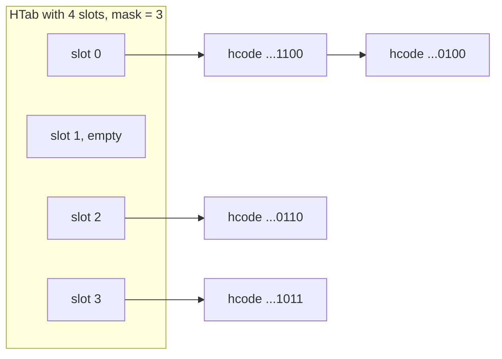
```mermaid
flowchart LR
    subgraph T["HTab with 4 slots, mask = 3"]
        direction TB
        S0["slot 0"]
        S1["slot 1, empty"]
        S2["slot 2"]
        S3["slot 3"]
    end
    S0 --> A["hcode ...1100"] --> B["hcode ...0100"]
    S2 --> C["hcode ...0110"]
    S3 --> D["hcode ...1011"]
```

- **Hashing.** Keys are hashed with a small FNV-style 32-bit hash, and the
  result is cached in `HNode.hcode`. Chain walks compare cached codes first and
  only compare key strings when the codes match.
- **Lookup returns the address of the link.** `h_lookup()` returns the
  `HNode**` that points at the match (either the slot head or the previous
  node's `next`), so deleting is one assignment with no special case for the
  head and no second walk:

```cpp
static HNode** h_lookup(HTab* htab, HNode* key, bool (*eq)(HNode*, HNode*)){
    if(!htab->tab) return nullptr;
    size_t pos = key->hcode & htab->mask;
    HNode** from = &htab->tab[pos];                 // points at the slot head first
    for(HNode* cur; (cur = *from) != nullptr; from = &cur->next){
        if(cur->hcode == key->hcode && eq(cur, key)) return from;
    }
    return nullptr;
}

static HNode* h_detach(HTab* htab, HNode** from){
    HNode* node = *from;
    *from = node->next;                             // splice it out
    htab->size--;
    return node;
}
```

- **Lookups use a probe.** Commands build a temporary `Entry` on the stack with
  just the key and its hash, and search with that. No allocation happens unless
  a key is actually inserted.

### Incremental rehashing

A normal hash table grows by allocating a bigger array and moving every key
into it in one go. With ten million keys, the unlucky command that triggers the
resize pays for all ten million moves, and on a single-threaded server every
other client waits too.

`HMap` avoids that by holding two tables, `newer` and `older`, and spreading
the move across many operations:

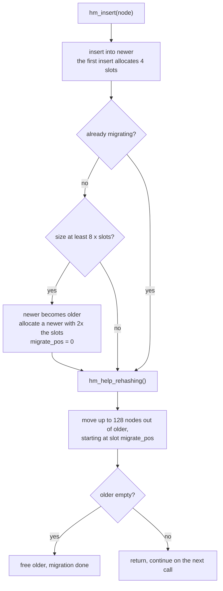
```mermaid
flowchart TD
    A["hm_insert(node)"] --> B["insert into newer<br/>the first insert allocates 4 slots"]
    B --> C{"already migrating?"}
    C -->|no| D{"size at least 8 x slots?"}
    D -->|yes| E["newer becomes older<br/>allocate a newer with 2x the slots<br/>migrate_pos = 0"]
    D -->|no| F
    C -->|yes| F["hm_help_rehashing()"]
    E --> F
    F --> G["move up to 128 nodes out of older,<br/>starting at slot migrate_pos"]
    G --> H{"older empty?"}
    H -->|yes| I["free older, migration done"]
    H -->|no| J["return, continue on the next call"]
```

Over time, a migration looks like this:

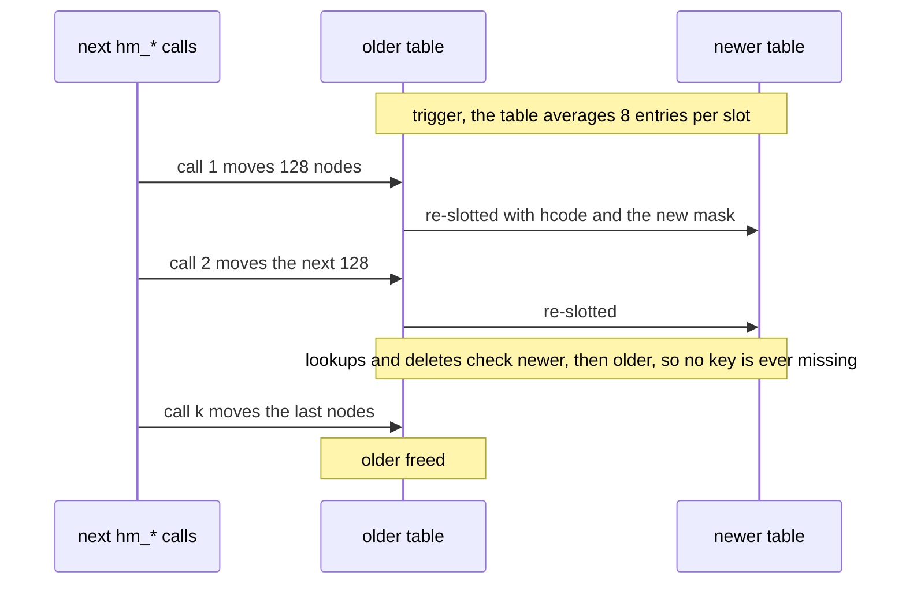
```mermaid
sequenceDiagram
    participant Ops as next hm_* calls
    participant O as older table
    participant N as newer table
    Note over O,N: trigger, the table averages 8 entries per slot
    Ops->>O: call 1 moves 128 nodes
    O->>N: re-slotted with hcode and the new mask
    Ops->>O: call 2 moves the next 128
    O->>N: re-slotted
    Note over O,N: lookups and deletes check newer, then older, so no key is ever missing
    Ops->>O: call k moves the last nodes
    Note over O: older freed
```

- Every `hm_lookup`, `hm_insert` and `hm_delete` does one bounded migration
  step first, so the cost of a resize is spread across the operations that
  follow it and no single command pays for all of it.
- Inserts always go into `newer`. Lookups and deletes search `newer` and then
  `older`, so every key stays reachable in the middle of a migration.
- A new resize can't start until the previous one has finished.
- The load factor of 8 is high on purpose: chains stay short enough to walk
  quickly, the slot array stays small, and resizes are rare. Right after a
  resize the average drops to 4.
- The property test inserts one million keys and checks that every one of them
  survives all the migrations along the way.

### Entries and the command paths

Every key in the keyspace is an `Entry`:

```cpp
struct Entry{
    HNode       node;                   // hook into the keyspace hash table
    std::string key;
    uint32_t    type = T_STR;           // T_STR or T_ZSET
    std::string str;                    // value when type == T_STR
    ZSet        zset;                   // value when type == T_ZSET
    size_t      heap_idx = (size_t)-1;  // slot in the TTL heap, or -1 for no TTL
};
```

The keyspace is a `Database`: the `HMap` of entries, the TTL heap, and a
pointer to the thread pool. All lookups go through `lookup_entry()`, which is
also where lazy expiry happens. Here is `GET`:

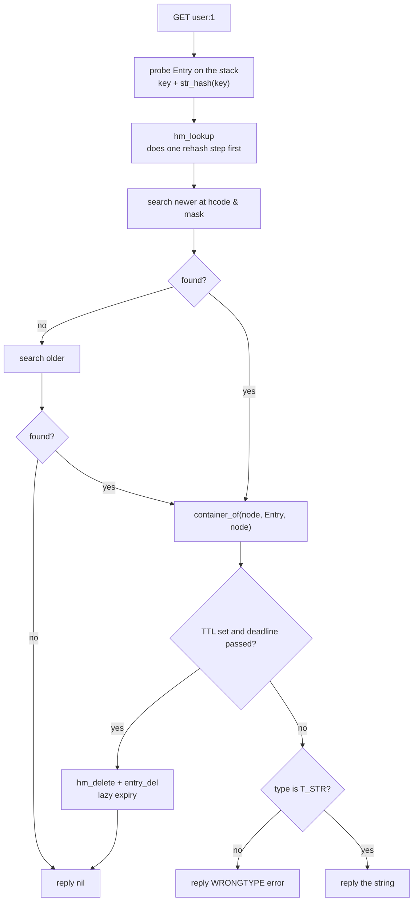
```mermaid
flowchart TD
    A["GET user:1"] --> B["probe Entry on the stack<br/>key + str_hash(key)"]
    B --> C["hm_lookup<br/>does one rehash step first"]
    C --> D["search newer at hcode & mask"]
    D --> E{"found?"}
    E -->|no| F["search older"]
    F --> G{"found?"}
    G -->|no| NL["reply nil"]
    E -->|yes| H["container_of(node, Entry, node)"]
    G -->|yes| H
    H --> I{"TTL set and deadline passed?"}
    I -->|yes| J["hm_delete + entry_del<br/>lazy expiry"]
    J --> NL
    I -->|no| K{"type is T_STR?"}
    K -->|no| WT["reply WRONGTYPE error"]
    K -->|yes| L["reply the string"]
```

- **`SET`** overwrites a string in place (and clears any TTL, as Redis does)
  or allocates a new `Entry` and inserts it. It refuses to overwrite a sorted
  set with `WRONGTYPE`. It replies nil.
- **`DEL`** unlinks the entry with `hm_delete` and passes it to `entry_del()`,
  which drops its timer and frees it, inline or on a worker thread (see
  [Thread pool](#thread-pool)).
- **`KEYS`** walks both tables with `hm_foreach` and returns every key.

---

## Sorted sets

A sorted set holds `(member, score)` pairs, and has to answer two different
kinds of question quickly:

- "What is alice's score?" is a point lookup **by member**.
- "Give me 10 members starting from score 2.0, skipping the first 20" is a
  range query **by order**.

No single structure is good at both, so each set keeps two indexes over the
same nodes.

### Two indexes, one allocation

```mermaid
flowchart TB
    ZS["ZSet"] --> HX["hmap: HMap keyed by member<br/>ZSCORE, ZREM, the existence check in ZADD"]
    ZS --> RT["root: AVL tree ordered by (score, member)<br/>ZQUERY seek, rank offset, ordered walk"]
    HX -.-> Z1["ZNode alice 1.5"]
    HX -.-> Z2["ZNode bob 2"]
    HX -.-> Z3["ZNode carol 3"]
    RT -.-> Z1
    RT -.-> Z2
    RT -.-> Z3
```

Each member is a single `ZNode` holding both hooks, the score, and the member
name inline:

```text
one malloc(sizeof(ZNode) + len), then placement-new
+-----------------------+---------------+--------+-----+-------------------------+
| AVLNode tree          | HNode hmap    | score  | len | name bytes, inline      |
| parent, left, right   | next, hcode   | double |     |                         |
| height, cnt           |               |        |     |                         |
+-----------------------+---------------+--------+-----+-------------------------+
```

The tree orders by the tuple `(score, member)`: score first, and equal scores
are broken by comparing member bytes. That gives a total order, so the tree
never holds two "equal" keys, and seeking to a position is always well-defined.

### AVL tree with subtree counts

The tree is an intrusive AVL tree with parent pointers. Each node stores two
extra numbers:

- **`height`**, used to keep the tree balanced: the heights of any node's two
  subtrees differ by at most 1, so the height stays `O(log n)`.
- **`cnt`**, the number of nodes in its subtree. This turns it into an
  **order-statistic tree**: a node's rank can be computed, and jumped to, in
  `O(log n)`.

An example set, with ranks in in-order position:

```mermaid
flowchart TB
    n3["bob 2.0 · rank 3<br/>height 3, cnt 6"] --> n1["alice 1.0 · rank 1<br/>height 2, cnt 3"]
    n3 --> n4["dave 3.0 · rank 4<br/>height 2, cnt 2"]
    n1 --> n0["zed 0.5 · rank 0<br/>height 1, cnt 1"]
    n1 --> n2["amy 1.5 · rank 2<br/>height 1, cnt 1"]
    n4 --> n5["erin 4.0 · rank 5<br/>height 1, cnt 1"]
```

After every insert or delete, `avl_fix()` walks from the changed node up to the
root, recomputing `height` and `cnt` and rotating wherever a node has become
unbalanced:

```mermaid
flowchart TD
    A["node changed by an insert or delete"] --> B["avl_update(node)<br/>height = 1 + max of child heights<br/>cnt = 1 + left cnt + right cnt"]
    B --> C{"left subtree 2 taller?"}
    C -->|yes| D["avl_fix_left<br/>if the left child leans right, rotate it left first<br/>then rotate this node right"]
    C -->|no| E{"right subtree 2 taller?"}
    E -->|yes| F["avl_fix_right<br/>the mirror image"]
    E -->|no| G
    D --> G{"has a parent?"}
    F --> G
    G -->|yes| H["move up to the parent"]
    H --> B
    G -->|no| I["return the root, which may have changed"]
```

A single rotation, for the left-left case:

```mermaid
flowchart LR
    subgraph BEFORE["before: 30 is left-heavy by 2"]
        direction TB
        A1["30"] --> B1["20"]
        B1 --> C1["10"]
    end
    subgraph AFTER["after rot_right at 30"]
        direction TB
        B2["20"] --> C2["10"]
        B2 --> A2["30"]
    end
    BEFORE -->|"rotate right"| AFTER
```

A rotation only re-links three pointers and recomputes `height` and `cnt` for
the two nodes that moved, so it is `O(1)`, and it keeps the in-order sequence
unchanged. Deleting a node with two children swaps in its in-order successor
(which has at most one child) and then fixes upward from where the successor
was taken.

### Rank queries

`avl_offset(node, k)` returns the node `k` positions after (or before) `node`
in sorted order, without visiting the nodes in between. It tracks its position
relative to the start and, at each step, uses subtree counts to decide whether
the target is below it or whether it has to climb.

Walking `+3` from alice (rank 1) in the tree above:

1. alice's right subtree holds 1 node, so the target at +3 is not below alice.
   Climb: alice is bob's left child, so bob is 1 (alice's right subtree) + 1 =
   **+2** from the start.
2. bob's right subtree holds 2 nodes, covering +3 and +4, so the target is
   below. Step right to dave, which is +2 + 0 (dave's left subtree) + 1 =
   **+3**. Done: rank 4.

Each step moves one level up or down, so any offset costs `O(log n)` instead of
`O(offset)` successor steps. Paging deep into a large set is as cheap as
reading the first page.

### ZADD and ZQUERY

```mermaid
flowchart TD
    A["ZADD board 2.5 alice"] --> B{"score parses as a number?<br/>NaN is rejected"}
    B -->|no| E1["error: value is not a valid float"]
    B -->|yes| C{"key exists?"}
    C -->|no| N["create an Entry of type T_ZSET<br/>hm_insert into the keyspace"]
    C -->|"yes, not a set"| E2["WRONGTYPE error"]
    C -->|"yes, a set"| L
    N --> L{"member in the hash index?"}
    L -->|yes| U["zset_update<br/>if the score changed: detach from the tree,<br/>set the score, re-insert"]
    U --> R0["reply 0"]
    L -->|no| I["znode_new, one malloc<br/>insert into the hash index and the tree"]
    I --> R1["reply 1"]
```

`ZQUERY key score member offset limit` is a general range query, built from
three primitives:

```mermaid
flowchart LR
    A["zset_seekge(score, member)<br/>first pair at or after the tuple<br/>O(log n)"] --> B["znode_offset(offset)<br/>skip by rank<br/>O(log n)"]
    B --> C["emit member, score<br/>then step +1<br/>until limit elements"]
```

`limit` counts output elements, and each pair emits two (member and score). An
empty member string with a score seeks to the first pair with that score or
higher:

```text
$ mini-redis-client zadd board 1.5 alice
$ mini-redis-client zadd board 2 bob
$ mini-redis-client zadd board 3 carol
$ mini-redis-client zadd board 2.5 alice     # update: alice moves from 1.5 to 2.5
(integer) 0
$ mini-redis-client zquery board 0 "" 0 10   # everything
(array of 6)
  "bob"
  (double) 2
  "alice"
  (double) 2.5
  "carol"
  (double) 3
$ mini-redis-client zquery board 2 "" 1 2    # from score 2, skip 1, one pair
(array of 2)
  "alice"
  (double) 2.5
```

---

## Timers and expiration

The server has two kinds of deadline: connections that have been idle too long,
and keys whose TTL has run out. Both are served by the same event loop, and both
use `CLOCK_MONOTONIC` milliseconds, which only move forward. The wall clock can
jump backwards or forwards when it is corrected, which would expire keys early
or keep them forever.

### One timeout for poll()

`poll()` takes a timeout, and the loop uses it as its timer: it sleeps until
either a socket is ready or the nearest deadline arrives, whichever comes
first.

```mermaid
flowchart LR
    I["idle list front<br/>last_active_ms + idle timeout"] --> M{"earliest"}
    H["TTL heap root<br/>ttl[0].val"] --> M
    M --> T["poll() timeout<br/>-1 if no timers, 0 if overdue,<br/>else milliseconds until due"]
```

After `poll()` returns, `process_timers()` handles whatever is due. Both
structures keep their earliest deadline at the front, so finding it is `O(1)`.

### Idle connections

Every connection has the same timeout, so the connection that was active
longest ago is always the next to expire. That means a plain list kept in
activity order is already sorted by deadline, with no sorting work at all.

```mermaid
flowchart LR
    HD["idle_list_ head"] --> A["Conn fd 7<br/>last active at t=100"]
    A --> B["Conn fd 5<br/>t=240"]
    B --> C["Conn fd 9<br/>t=310"]
    C --> HD
```

- The list is circular and doubly linked, with a dummy head, so insert and
  detach never need a special case for an empty list or an end node.
- A new connection is appended at the tail.
- Any readiness on a connection moves it to the tail: `dlist_detach()` plus
  `dlist_insert_before(head)`, both `O(1)`.
- `process_timers()` closes connections from the front until it reaches one
  that isn't due, then stops. Everything behind that one is newer.
- `Conn`'s destructor detaches its hook and closes the fd, so a connection
  closed for any reason leaves the list correctly.

### Key expiration on a min-heap

TTLs are arbitrary, so key deadlines arrive in no particular order and do need
sorting. A binary **min-heap** stored in a `std::vector<HeapItem>` keeps the
earliest deadline at index 0, with `O(log n)` insert and delete and no
per-item allocation. The children of `a[i]` are `a[2i+1]` and `a[2i+2]`.

```mermaid
flowchart TB
    subgraph HEAP["db.ttl, a vector of HeapItem"]
        direction TB
        H0["a[0] val 1000"]
        H1["a[1] val 4000"]
        H2["a[2] val 2500"]
        H3["a[3] val 9000"]
        H0 --> H1
        H0 --> H2
        H1 --> H3
    end
    E0["Entry session<br/>heap_idx = 0"]
    E3["Entry report<br/>heap_idx = 3"]
    H0 -.->|"ref"| E0
    H3 -.->|"ref"| E3
```

A plain heap can only give you its minimum. `PERSIST`, a second `EXPIRE`, or
`DEL` need to find and change **one particular key's** item, which could be
anywhere in the array. So each `HeapItem` carries a back-pointer:

```cpp
struct HeapItem{
    uint64_t val = 0;          // deadline, monotonic ms
    size_t*  ref = nullptr;    // points at the owning Entry's heap_idx
};
```

Every time the heap moves an item, it writes the item's new index back through
`ref`:

```cpp
static void heap_up(HeapItem* a, size_t pos){
    HeapItem t = a[pos];
    while(pos > 0 && a[heap_parent(pos)].val > t.val){
        a[pos] = a[heap_parent(pos)];
        *a[pos].ref = pos;              // keep the owner's index in sync
        pos = heap_parent(pos);
    }
    a[pos] = t;
    *a[pos].ref = pos;
}
```

So an `Entry` always knows where its timer is (`heap_idx`), and the reaper can
go from a heap item back to its entry with
`container_of(item.ref, Entry, heap_idx)`.

| Operation | What happens | Cost |
|---|---|---|
| Set or change a TTL | `heap_upsert`: overwrite the item at `heap_idx`, or append a new one, then sift up or down | `O(log n)` |
| Remove a TTL | `heap_delete`: move the last item into the hole, pop, re-sift, reset `heap_idx` to -1 | `O(log n)` |
| Nearest deadline | `ttl[0]` | `O(1)` |

### Lazy and active expiry

A key whose deadline has passed can be removed two ways, and the server uses
both.

```mermaid
sequenceDiagram
    participant C as client
    participant L as event loop
    participant DB as keyspace
    participant H as TTL heap
    C->>L: PEXPIRE session 5000
    L->>DB: lookup_entry(session)
    L->>H: heap_upsert(now + 5000)
    H-->>DB: writes session.heap_idx
    L-->>C: (integer) 1
    Note over L: poll() now sleeps 5000 ms at most
    alt a client reads the key first
        C->>L: GET session, after the deadline
        L->>DB: lookup_entry sees it is overdue
        L->>DB: hm_delete + entry_del
        L-->>C: (nil)
    else nobody reads it
        L->>H: process_timers, root is due
        H-->>L: ref points at session.heap_idx
        L->>DB: container_of, hm_delete, entry_del
    end
```

- **Lazy expiry** in `lookup_entry()` means no command can ever see a key past
  its deadline, even if the reaper hasn't reached it yet.
- **Active expiry** in `process_timers()` means keys nobody reads again still
  get their memory back.
- **The reaper is capped at 2000 keys per pass.** If a million keys expire at
  the same moment, reaping them all in one pass would stall every client.
  Whatever is left over makes `next_timer_ms()` return 0, so the next `poll()`
  doesn't sleep; it just services I/O and comes straight back to reap the next
  batch.

TTL behavior matches Redis:

| Command | Behavior |
|---|---|
| `EXPIRE key s` / `PEXPIRE key ms` | Sets or replaces the deadline. 1 if the key exists, else 0. A non-positive TTL deletes the key immediately. Huge values are clamped rather than overflowing. |
| `TTL key` / `PTTL key` | Remaining time, in seconds rounded up or in milliseconds. -2 if there is no such key, -1 if the key has no TTL. |
| `PERSIST key` | Removes the TTL. 1 if one was removed, else 0. |
| `SET key value` | Overwriting a key discards its TTL. |

---

## Thread pool

Freeing a sorted set means freeing every one of its nodes, which is `O(n)`.
For a set with a million members that's long enough to stall every other
client if it runs on the event loop. So `DEL` (and expiry) hand large values to
a pool of 4 worker threads and return immediately.

```mermaid
sequenceDiagram
    participant C as client
    participant L as event loop
    participant Q as work queue
    participant W as worker
    C->>L: DEL leaderboard (1M members)
    L->>L: hm_delete, drop TTL timer
    L->>Q: lock, push task, unlock
    Q-->>W: notify_one
    L-->>C: (integer) 1, right away
    W->>Q: lock, pop task, unlock
    W->>W: zset_clear + delete, O(n)
    Note over L: the loop keeps serving other clients meanwhile
```

Measured on a laptop: `DEL` of a 1,000,000-member sorted set replies in about
0.07 ms, while other clients' commands keep a sub-0.1 ms median.

Each worker runs a standard producer/consumer loop:

```mermaid
flowchart TD
    A["lock the mutex"] --> B{"queue empty and not stopping?"}
    B -->|yes| C["wait on the condition variable<br/>the mutex is released while asleep"]
    C --> B
    B -->|no| D{"queue empty?"}
    D -->|yes| X["stopping and nothing left: exit"]
    D -->|no| E["pop the front task"]
    E --> F["unlock"]
    F --> G["run the task"]
    G --> A
```

- **The wait re-checks its condition.** Condition variables can wake up
  spuriously, and another worker may have taken the task first, so a worker
  only proceeds when the queue really has work.
- **Tasks never run under the lock.** The mutex protects only the queue, so a
  long teardown never blocks the event loop from queueing more work.
- **Queueing never blocks and never allocates much.** A task is a plain
  function pointer plus an argument; the event loop only holds the mutex long
  enough to push it.
- **Small values are freed inline.** Only sorted sets with more than 1000
  members go to the pool. For anything smaller, the hand-off costs more than
  the free itself.
- **It is safe without any locking on the data.** By the time a value is
  queued it has been unlinked from the keyspace and its timer removed. No other
  thread can reach it, so the worker only touches memory nobody else sees, and
  commands on the event loop stay atomic.
- **Clean shutdown.** The destructor sets `stop_` under the lock, wakes every
  worker, and joins them. Workers finish whatever is still queued before
  exiting, so nothing leaks.

---

## Class model (UML)

The server side: the event loop, its connections, and what it owns.

```mermaid
classDiagram
    class Server {
        -Socket listen_sock_
        -vector~Conn~ conns_
        -Database db_
        -ThreadPool pool_
        -DList idle_list_
        -uint64_t idle_timeout_ms_
        +run()
        -accept_new()
        -handle_read(Conn)
        -handle_write(Conn)
        -try_one_request(Conn) bool
        -next_timer_ms() int32_t
        -process_timers()
    }
    class Socket {
        -int fd_
        +fd() int
        +release() int
        +reset(int)
        +set_nonblocking()
    }
    class Conn {
        +int fd
        +bool want_read
        +bool want_write
        +bool want_close
        +bytes incoming
        +bytes outgoing
        +uint64_t last_active_ms
        +DList idle_node
    }
    class DList {
        +DList prev
        +DList next
    }
    class ThreadPool {
        -vector~thread~ threads_
        -deque~Work~ queue_
        -mutex mu_
        -condition_variable not_empty_
        -bool stop_
        +queue(fn, arg)
        -worker_loop()
    }
    class Database {
        +HMap map
        +vector~HeapItem~ ttl
        +ThreadPool pool
    }
    Server *-- Socket : listener
    Server "1" *-- "0..*" Conn : conns_ by fd
    Server *-- DList : idle list head
    Server *-- ThreadPool : pool_
    Server *-- Database : db_
    Conn *-- DList : idle_node hook
    Database --> ThreadPool : large frees
```

The storage side: the keyspace and every structure it is built from.

```mermaid
classDiagram
    class Database {
        +HMap map
        +vector~HeapItem~ ttl
    }
    class HMap {
        +HTab newer
        +HTab older
        +size_t migrate_pos
    }
    class HTab {
        +HNode tab
        +size_t mask
        +size_t size
    }
    class HNode {
        +HNode next
        +uint64_t hcode
    }
    class Entry {
        +HNode node
        +string key
        +uint32_t type
        +string str
        +ZSet zset
        +size_t heap_idx
    }
    class ZSet {
        +AVLNode root
        +HMap hmap
    }
    class ZNode {
        +AVLNode tree
        +HNode hmap
        +double score
        +size_t len
        +char name
    }
    class AVLNode {
        +AVLNode parent
        +AVLNode left
        +AVLNode right
        +uint32_t height
        +uint32_t cnt
    }
    class HeapItem {
        +uint64_t val
        +size_t ref
    }
    Database *-- HMap : keyspace
    Database *-- "0..*" HeapItem : TTL heap
    HMap *-- "2" HTab : newer + older
    HTab o-- "0..*" HNode : slot chains
    Entry *-- HNode : hook
    Entry *-- ZSet : value
    ZSet *-- HMap : by member
    ZSet o-- "0..*" ZNode : via hooks
    ZNode *-- AVLNode : tree hook
    ZNode *-- HNode : hmap hook
    HeapItem --> Entry : ref to heap_idx
```

Pointers are drawn as plain fields here (`HNode next` is an `HNode*`,
`HTab.tab` is an `HNode**`, `conns_` holds `unique_ptr<Conn>`). The "hook"
relationships are the intrusive links from
[Intrusive data structures](#intrusive-data-structures).

---

## Commands

| Command | Arguments | Reply |
|---|---|---|
| `GET` | `key` | string, or nil if absent |
| `SET` | `key value` | nil |
| `DEL` | `key` | integer: 1 if removed, else 0 |
| `KEYS` | none | array of every key |
| `EXPIRE` | `key seconds` | integer: 1 if the key exists, else 0 |
| `PEXPIRE` | `key milliseconds` | integer: 1 if the key exists, else 0 |
| `TTL` | `key` | integer seconds left (-2 no key, -1 no TTL) |
| `PTTL` | `key` | integer milliseconds left (-2 no key, -1 no TTL) |
| `PERSIST` | `key` | integer: 1 if a TTL was removed, else 0 |
| `ZADD` | `key score member` | integer: 1 for a new member, 0 for a score update |
| `ZREM` | `key member` | integer: 1 if removed, else 0 |
| `ZSCORE` | `key member` | double, or nil if absent |
| `ZQUERY` | `key score member offset limit` | array of alternating member, score |

Verbs are case-insensitive. A wrong argument count or an unknown verb gets
`(error 1) unknown command`; a non-numeric score, TTL, offset or limit gets
error code 2; using a string command on a sorted set (or the reverse) gets
`WRONGTYPE`, error code 3.

A session with real output:

```text
$ mini-redis-client set user:1 alice
(nil)
$ mini-redis-client ttl user:1
(integer) -1
$ mini-redis-client pexpire user:1 5000
(integer) 1
$ mini-redis-client ttl user:1
(integer) 5
$ mini-redis-client persist user:1
(integer) 1
$ mini-redis-client zadd board 1.5 alice
(integer) 1
$ mini-redis-client zscore board alice
(double) 1.5
$ mini-redis-client get board
(error 3) WRONGTYPE Operation against a key holding the wrong kind of value
$ mini-redis-client hello
(error 1) unknown command
$ mini-redis-client keys
(array of 2)
  "board"
  "user:1"
$ mini-redis-client del user:1
(integer) 1
$ mini-redis-client del user:1
(integer) 0
```

---

## Build, run, test

Requires CMake 3.20 or newer and a C++17 compiler. Catch2 is fetched
automatically.

```bash
cmake -B build
cmake --build build -j
```

Start the server (arguments are optional: port, then idle timeout in ms):

```bash
./build/mini-redis-server 6379 30000
```

Send commands one at a time from the shell:

```bash
./build/mini-redis-client set greeting hello
```

Or open an interactive session (`exit` to quit):

```bash
./build/mini-redis-client
```

Run the test suite:

```bash
ctest --test-dir build --output-on-failure
```

What the tests cover:

| Area | What is checked |
|---|---|
| `Socket` | closes on destruction, move construction and assignment, `release`, `reset`, self-move |
| Wire | `u32` round-trip, little-endian layout, the 32 KiB cap |
| `parse_req` | happy path, zero args, empty strings, truncated header, missing body, lengths past the end, trailing garbage, absurd counts |
| Serializer | byte layout of every tag, arrays |
| Hash table | 10k insert/lookup/delete, and 1M keys surviving every incremental migration |
| AVL tree | balance under sequential inserts, two-child deletion, edge cases, rank offsets, and 100k random operations against a multiset model with a full structural audit along the way |
| Sorted set | both indexes stay in sync, tie-breaking by member, seek bounds, rank offsets in both directions, and 10k random operations against a two-index model |
| Intrusive list | empty head, FIFO order, detach and reuse |
| Heap | min at the root, updates moving up or down, sorted drain, and 5k random upserts/deletes checking both the heap order and every back-pointer |
| Thread pool | every task runs exactly once, `queue()` never blocks, work runs off the calling thread |

CI runs on every push and pull request with GitHub Actions: Linux and macOS,
gcc and clang, Debug and Release builds, plus separate jobs under
AddressSanitizer + UndefinedBehaviorSanitizer and ThreadSanitizer (the latter
matters for the thread pool).

---

## Project layout

```text
mini-redis/
├── CMakeLists.txt              builds the mini-redis-core static library, server, client, tests
├── include/                    headers, mirrored by src/
│   ├── common/                 container_of, string hash, monotonic clock, logging
│   ├── ds/                     AVL tree, sorted set, doubly-linked list, timer heap
│   ├── net/                    Socket (RAII), read_full / write_all
│   ├── protocol/               framing + parse_req, reply serializer
│   ├── server/                 Server (event loop), Conn, command dispatch
│   ├── store/                  hash table, Entry, Database + TTL
│   └── threadpool/             worker pool
├── src/                        implementations, plus main.cpp
├── client/                     command-line client
├── tests/unit/                 Catch2 tests
├── docs/architecture.md        longer design notes
└── .github/workflows/ci.yml    CI matrix and sanitizer jobs
```

Where each part of the flow lives:

| Concern | File | Key functions |
|---|---|---|
| Event loop, accept, read/write, framing | `src/server/server.cpp` | `Server::run`, `accept_new`, `handle_read`, `handle_write`, `try_one_request`, `next_timer_ms`, `process_timers` |
| Per-connection state | `include/server/conn.h` | `Conn` |
| Command handlers and dispatch | `src/server/command.cpp` | `do_request`, `lookup_entry`, `do_get` ... `do_zquery` |
| Wire format | `src/protocol/wire.cpp` | `read_u32`, `write_u32`, `parse_req` |
| Reply encoding | `src/protocol/serialize.cpp` | `out_nil`, `out_str`, `out_int`, `out_dbl`, `out_err`, `out_arr`, `out_begin_arr`, `out_end_arr` |
| Hash table | `src/store/hashtable.cpp` | `hm_insert`, `hm_lookup`, `hm_delete`, `hm_help_rehashing`, `hm_foreach` |
| Keyspace entries and TTL | `include/store/entry.h`, `src/store/database.cpp` | `Entry`, `entry_set_ttl`, `entry_del` |
| AVL tree | `src/ds/avl.cpp` | `avl_fix`, `avl_del`, `avl_offset` |
| Sorted set | `src/ds/zset.cpp` | `zset_insert`, `zset_lookup`, `zset_delete`, `zset_seekge`, `znode_offset` |
| Idle list | `include/ds/dlist.h` | `dlist_insert_before`, `dlist_detach` |
| Timer heap | `src/ds/heap.cpp` | `heap_upsert`, `heap_delete`, `heap_update` |
| Thread pool | `src/threadpool/thread_pool.cpp` | `ThreadPool::queue`, `worker_loop` |
| Sockets | `src/net/socket.cpp`, `src/net/io_helpers.cpp` | `Socket`, `read_full`, `write_all` |
| Utilities | `include/common/` | `container_of`, `str_hash`, `get_monotonic_msec` |

---

## Design decisions and trade-offs

- **One thread for all data access.** Every command runs to completion before
  the next one starts, so each is atomic by construction and there are no locks
  on the keyspace. The price is that one slow command delays everyone, which is
  why rehashing, expiry and large frees are all bounded or moved off the loop.
  It also means one CPU core does the work; scaling across cores would mean
  sharding or I/O threads.
- **`poll()` over `epoll`/`kqueue`.** Portable and simple, but `O(total fds)`
  per call. It is confined to `Server::run()` so a platform backend can replace
  it.
- **A hand-written intrusive hash table instead of `std::unordered_map`.**
  `std::unordered_map` rehashes everything at once when it grows. Writing the
  table made incremental rehashing possible, keeps one allocation per key, and
  lets the same hook pattern serve the sorted set and the timers.
- **AVL instead of a skip list or red-black tree.** AVL trees are more strictly
  balanced, so lookups are slightly faster, and the subtree counts slot neatly
  into the same bottom-up update that maintains heights. Redis itself uses a
  skip list with span counts for the same rank queries.
- **A list for idle timers and a heap for TTLs.** A fixed timeout makes the
  list sorted for free. Arbitrary TTLs need a real priority queue, and the heap
  with back-pointers supports updating and removing any key's timer.
- **A binary protocol instead of RESP.** Framing and parsing are trivial and
  allocation-bounded, and replies carry exact types. The cost is compatibility:
  `redis-cli` and existing client libraries can't talk to it yet.
- **Simple buffers.** `incoming` and `outgoing` are `std::vector<uint8_t>`, and
  consuming from the front shifts the remaining bytes. That's fine for small
  pipelines; a ring buffer or a read offset would avoid the copy under heavy
  pipelining.
- **Connections are indexed by fd.** `conns_[fd]` is `O(1)`. The number of
  clients is limited by the process's file-descriptor limit (`ulimit -n`); there
  is no separate `maxclients` setting.
- **Workers only ever see orphaned data.** Values are unlinked before they are
  queued, so adding threads didn't weaken the single-thread atomicity model.

---

## Roadmap

Built so far: the socket layer and non-blocking event loop with pipelining and
back-pressure, the binary wire protocol and typed reply serialization, the
hash-table keyspace with incremental rehashing, sorted sets on an
order-statistic AVL tree plus hash index, idle-connection timeouts, per-key TTL
with lazy and active expiry, and a thread pool for freeing large values, all
under a sanitizer-checked CI matrix.

Planned next:

- More value types: lists, hashes, sets
- A RESP front end so `redis-cli` and standard client libraries can connect
- Approximate LRU eviction under a memory limit
- Durability: an append-only log and point-in-time snapshots
- Publish/subscribe
- An `epoll`/`kqueue` backend behind the same loop
- Throughput and latency benchmarks against real Redis
