# mini-redis Architecture

> Living document covering the architecture, design, and internal behaviour of mini-redis. Diagrams are Mermaid (renders natively on GitHub). Some components below are aspirational (planned by June 30, 2026); the **Status** column in the Component Inventory shows what is implemented vs in-progress.

---

## Table of Contents

1. [System Overview](#1-system-overview)
2. [Layered Architecture](#2-layered-architecture)
3. [Component Inventory](#3-component-inventory)
4. [Component Diagram](#4-component-diagram)
5. [Class Diagrams](#5-class-diagrams)
   - [5.1 Net + Server core](#51-net--server-core)
   - [5.2 Storage layer](#52-storage-layer)
   - [5.3 Data structures](#53-data-structures)
   - [5.4 Persistence](#54-persistence)
   - [5.5 Pub/Sub & threading](#55-pubsub--threading)
6. [Sequence Diagrams](#6-sequence-diagrams)
   - [6.1 Connection lifecycle](#61-connection-lifecycle)
   - [6.2 GET command](#62-get-command)
   - [6.3 SET command (with AOF)](#63-set-command-with-aof)
   - [6.4 BGSAVE (background snapshot)](#64-bgsave-background-snapshot)
   - [6.5 Pub/Sub PUBLISH fan-out](#65-pubsub-publish-fan-out)
   - [6.6 TTL expiration (lazy + active)](#66-ttl-expiration-lazy--active)
   - [6.7 Progressive rehashing](#67-progressive-rehashing)
   - [6.8 Server startup & recovery](#68-server-startup--recovery)
7. [Activity Diagrams](#7-activity-diagrams)
   - [7.1 Event loop iteration](#71-event-loop-iteration)
   - [7.2 Request parsing (try_one_request)](#72-request-parsing-try_one_request)
   - [7.3 LRU eviction sweep](#73-lru-eviction-sweep)
8. [State Diagrams](#8-state-diagrams)
   - [8.1 Connection state machine](#81-connection-state-machine)
   - [8.2 HMap rehashing state](#82-hmap-rehashing-state)
9. [Use Case Diagram](#9-use-case-diagram)
10. [Data Model (ER-style)](#10-data-model-er-style)
11. [Wire & Storage Formats](#11-wire--storage-formats)
12. [Deployment / System Design](#12-deployment--system-design)
13. [Concurrency Model](#13-concurrency-model)
14. [Failure Modes & Recovery](#14-failure-modes--recovery)
15. [Performance Budget](#15-performance-budget)
16. [Future / Post-v1.0 Extensions](#16-future--post-v10-extensions)

---

## 1. System Overview

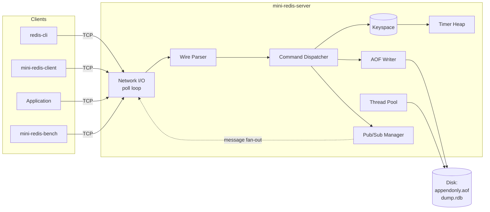

**One-paragraph summary.** mini-redis is a single-threaded, event-loop-based, RESP-style in-memory data store written in C++17. A `poll()`-based reactor multiplexes thousands of TCP connections on the main thread. Every command is parsed, dispatched against a typed keyspace (custom hashtable with progressive rehashing), and may emit a side effect (AOF append, Pub/Sub fan-out, TTL registration). A worker thread pool handles only background tasks that would block the reactor: large-object deletion, RDB snapshots, AOF rewrites.

---

## 2. Layered Architecture

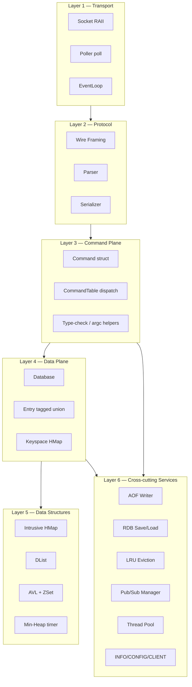

Dependencies point downward. Higher layers know about lower layers; lower layers know nothing about higher layers. The `EventLoop` (L1) does not know what RESP is; the `CommandTable` (L3) does not know what `poll()` is; the `HMap` (L5) does not know there is a database.

---

## 3. Component Inventory

| # | Component | Purpose | File(s) | Implemented? |
|--:|---|---|---|:--:|
| 1 | `Socket` | RAII wrapper around fd | `include/net/socket.h` | ❌ (Day 2) |
| 2 | `io_helpers` | `read_full`, `write_all` | `src/net/io_helpers.cpp` | ❌ (Day 3) |
| 3 | `EventLoop` | poll() reactor, conn table | `src/net/event_loop.cpp` | ❌ (Day 5-6) |
| 4 | `Conn` | Per-connection state + buffers | `include/server/conn.h` | ❌ (Day 5) |
| 5 | Wire parser | Length-prefixed → argv | `src/protocol/wire.cpp` | ❌ (Day 3, 7) |
| 6 | Serializer | `out_str/int/dbl/nil/err/arr` | `src/protocol/wire.cpp` | ❌ (Day 10) |
| 7 | `CommandTable` | Dispatch map | `include/server/cmd_table.h` | ❌ (Day 7) |
| 8 | `HMap` | Intrusive open-chained hashtable | `src/store/hashtable.cpp` | ❌ (Day 8-9) |
| 9 | `Database` | Keyspace facade | `include/store/database.h` | ❌ (Day 7+) |
| 10 | `Entry` | Tagged-union value record | `include/store/entry.h` | ❌ (Day 7+) |
| 11 | `DList` | Intrusive doubly-linked list | `include/ds/dlist.h` | ❌ (Day 17) |
| 12 | `AVLNode` | Balanced BST with subtree count | `src/ds/avl.cpp` | ❌ (Day 11) |
| 13 | `ZSet` | AVL + HMap for sorted sets | `src/ds/zset.cpp` | ❌ (Day 12) |
| 14 | `TimerHeap` | Min-heap of (deadline, ref) | `src/ds/heap.cpp` | ❌ (Day 14) |
| 15 | `AofWriter` | Append + fsync policies | `src/persistence/aof.cpp` | ❌ (Day 20-21) |
| 16 | `RDB` | Binary snapshot save/load | `src/persistence/rdb.cpp` | ❌ (Day 22-23) |
| 17 | `LruEvictor` | Approximated LRU | `src/eviction/lru.cpp` | ❌ (Day 24) |
| 18 | `PubSubManager` | Channels + patterns | `src/pubsub/pubsub.cpp` | ❌ (Day 25) |
| 19 | `ThreadPool` | Worker threads + task queue | `src/threadpool/thread_pool.cpp` | ❌ (Day 15) |
| 20 | CMake build | Build system | `CMakeLists.txt` | ✅ (Day 1) |
| 21 | Catch2 tests | Unit test framework | `tests/CMakeLists.txt` | ✅ (Day 1) |
| 22 | `Server` | Acceptor + glue (current) | `src/server/server.cpp` | 🟡 (skeleton) |
| 23 | `mini-redis-client` | Interactive CLI | `client/client.cpp` | 🟡 (REPL) |
| 24 | `mini-redis-bench` | Multi-threaded bench | `benchmark/bench.cpp` | ❌ (Day 27-28) |

Legend: ✅ done · 🟡 partial · ❌ not started

---

## 4. Component Diagram

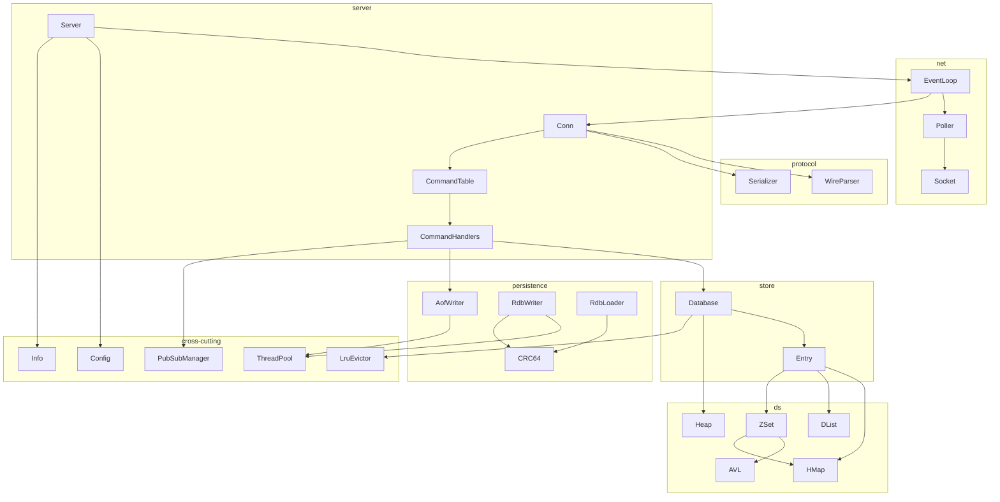

---

## 5. Class Diagrams

### 5.1 Net + Server core

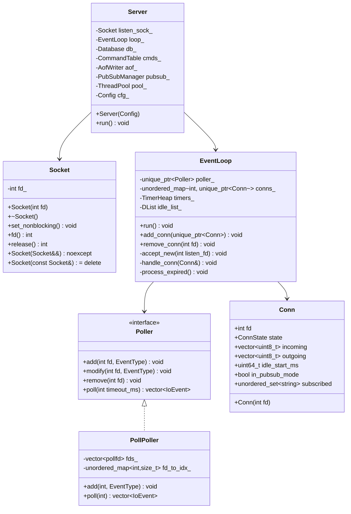

### 5.2 Storage layer

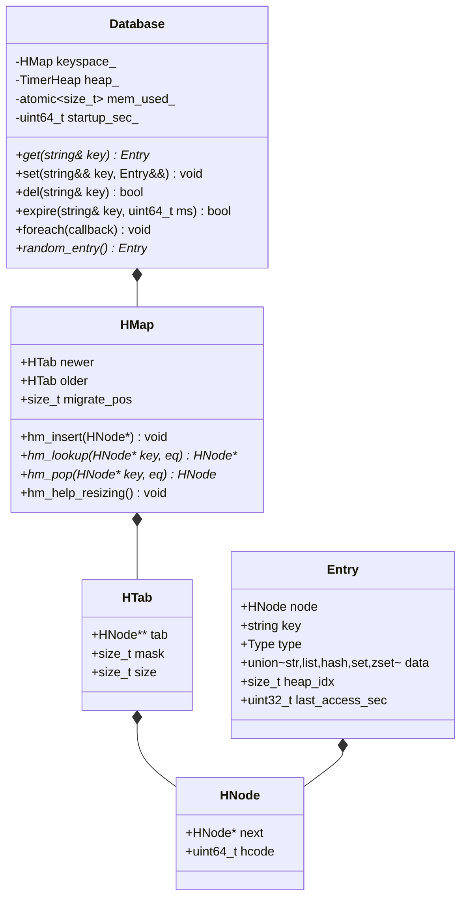

### 5.3 Data structures

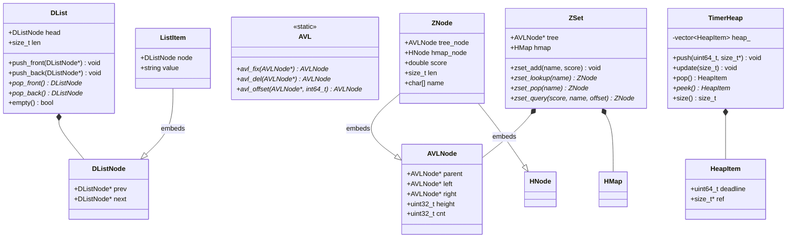

### 5.4 Persistence

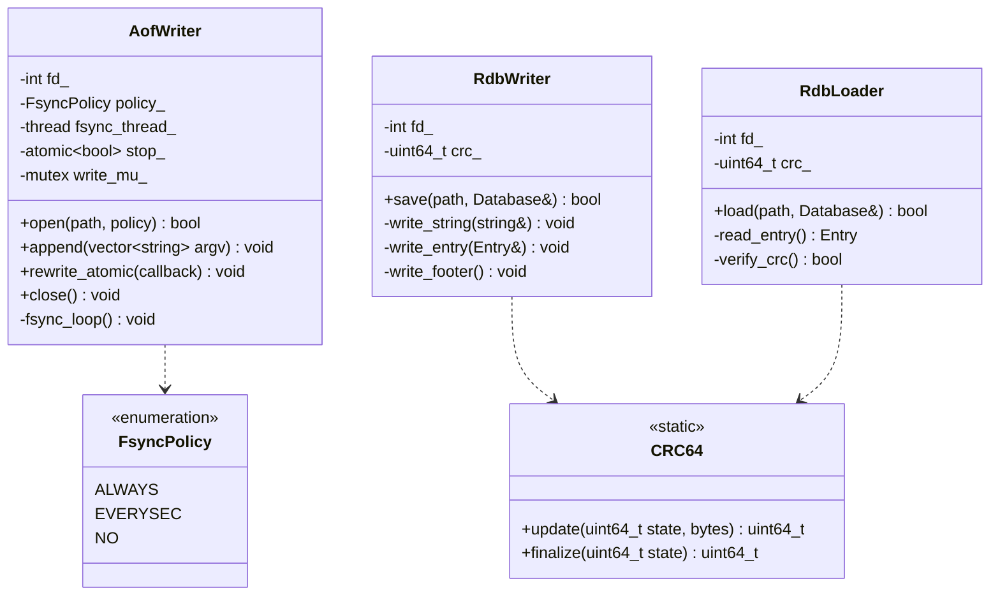

### 5.5 Pub/Sub & threading

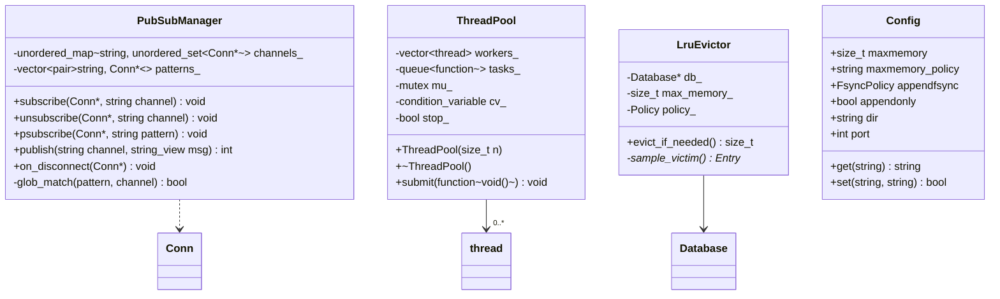

---

## 6. Sequence Diagrams

### 6.1 Connection lifecycle

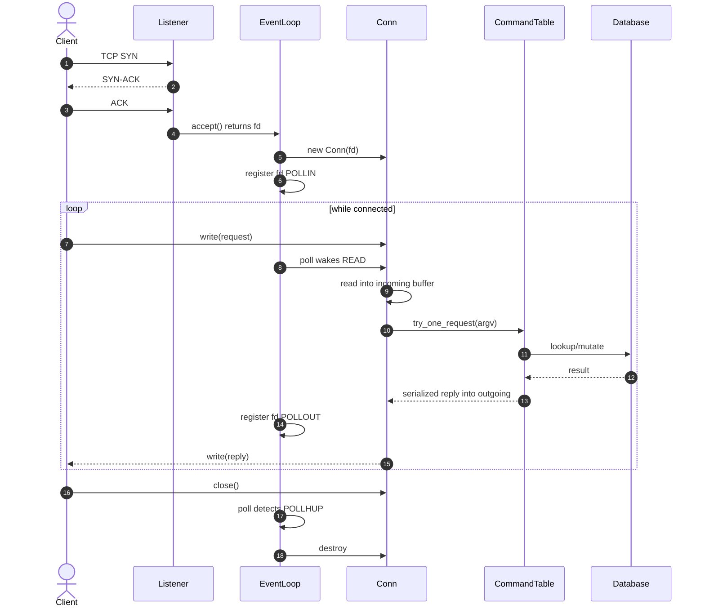

### 6.2 GET command

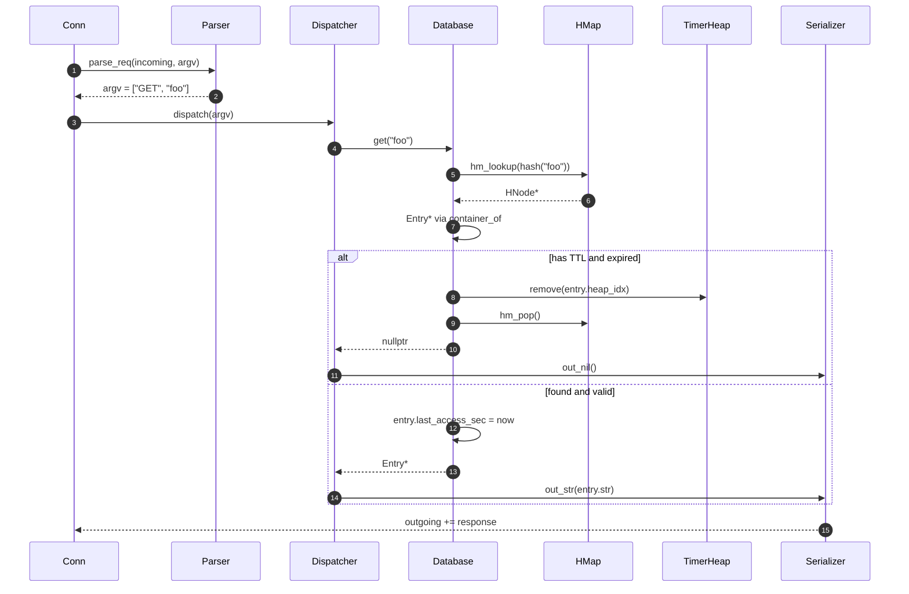

### 6.3 SET command (with AOF)

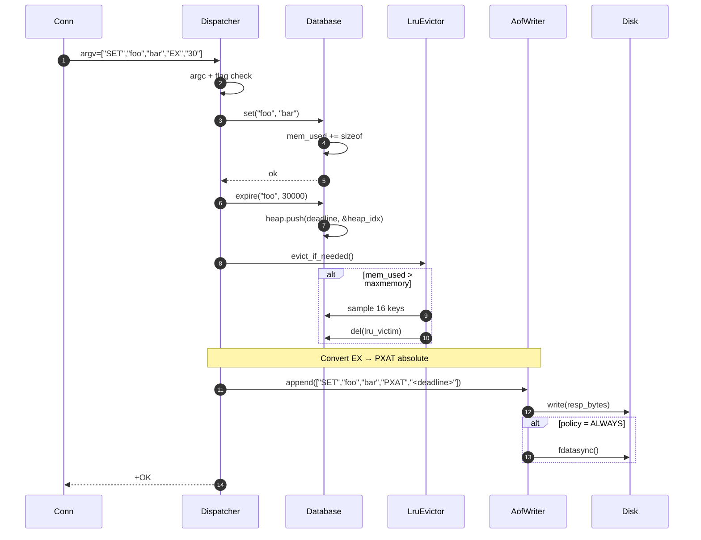

### 6.4 BGSAVE (background snapshot)

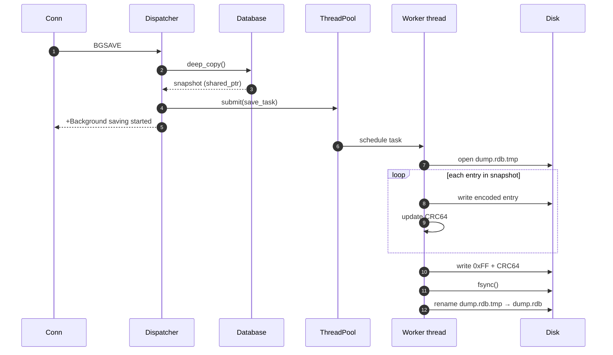

### 6.5 Pub/Sub PUBLISH fan-out

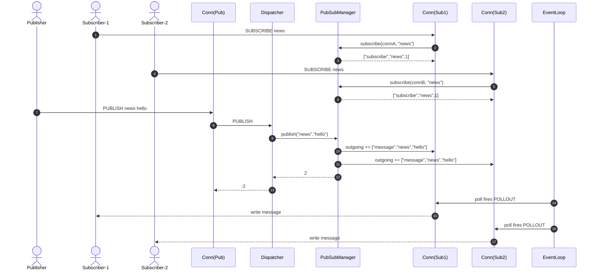

### 6.6 TTL expiration (lazy + active)

```mermaid
sequenceDiagram
    autonumber
    participant Loop as EventLoop
    participant Heap as TimerHeap
    participant DB as Database
    participant Client

    Note over Loop: top of each iteration
    Loop->>Heap: peek()
    alt heap empty
        Loop->>Loop: timeout = idle_timeout
    else top.deadline <= now
        loop up to ACTIVE_EXPIRE_MAX
            Heap->>DB: get entry via ref
            DB->>DB: hm_pop, free
            DB->>Heap: pop
        end
    else top.deadline > now
        Loop->>Loop: timeout = min(idle, top.deadline-now)
    end
    Loop->>Loop: poll(timeout)

    Note over Client,DB: lazy path
    Client->>DB: GET foo
    DB->>DB: entry.expires_at <= now?
    alt expired
        DB->>Heap: remove(entry.heap_idx)
        DB->>DB: hm_pop, free
        DB-->>Client: nil
    end
```

### 6.7 Progressive rehashing

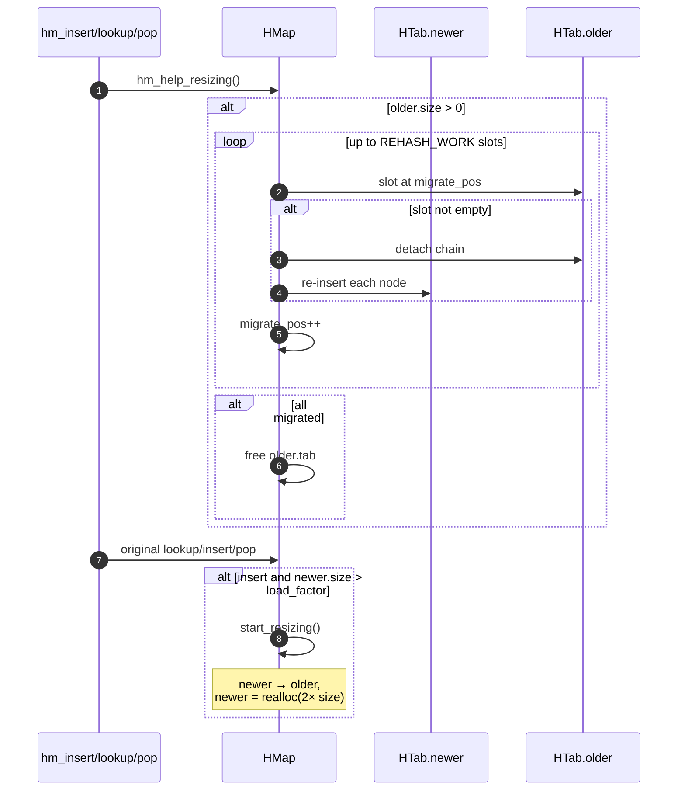

### 6.8 Server startup & recovery

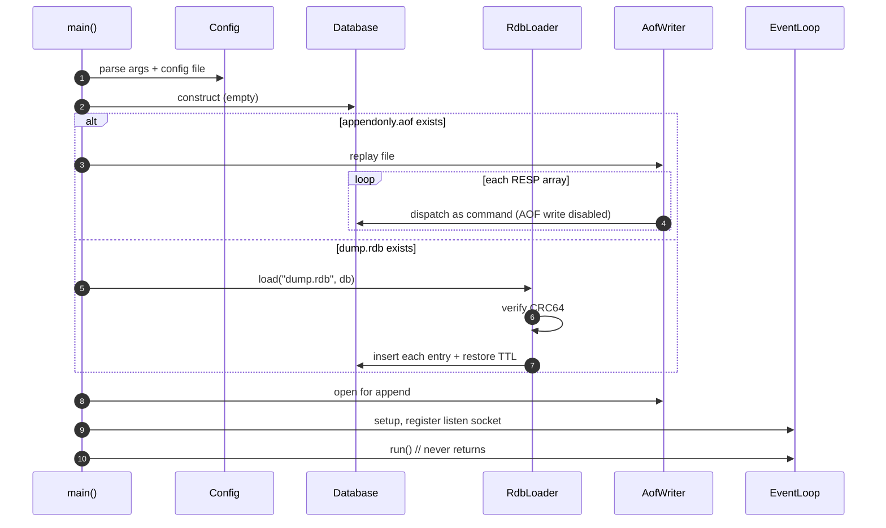

---

## 7. Activity Diagrams

### 7.1 Event loop iteration

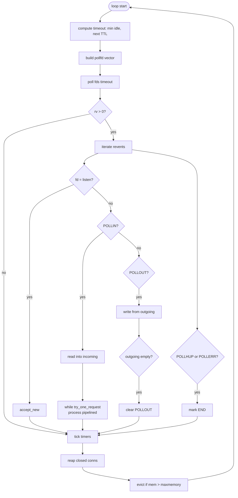

### 7.2 Request parsing (try_one_request)

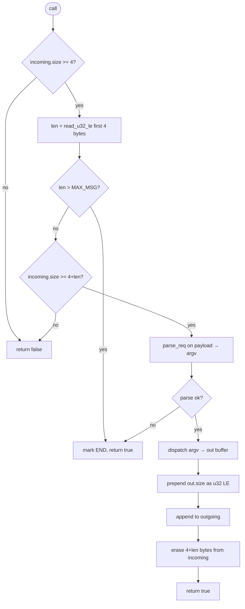

### 7.3 LRU eviction sweep

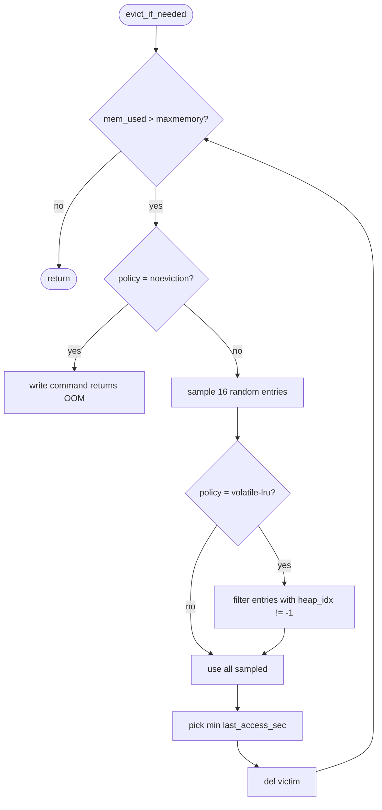

---

## 8. State Diagrams

### 8.1 Connection state machine

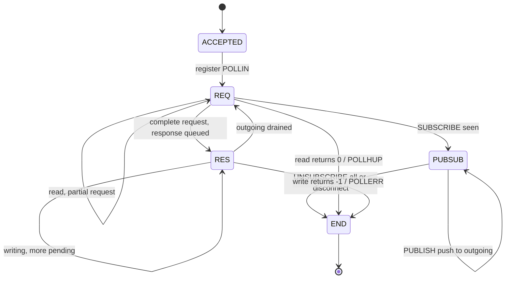

### 8.2 HMap rehashing state

```mermaid
stateDiagram-v2
    [*] --> STABLE
    STABLE --> RESIZING: load_factor > threshold
    note right of RESIZING
        newer → older
        newer = realloc(2× size)
        migrate_pos = 0
    end note
    RESIZING --> RESIZING: each op migrates REHASH_WORK slots
    RESIZING --> STABLE: older.size == 0 → free older
    STABLE --> SHRINKING: load_factor < min_threshold (optional)
    SHRINKING --> STABLE: migration done
```

---

## 9. Use Case Diagram

Mermaid doesn't render true UML use case bubbles; this is a stylised equivalent.

```mermaid
flowchart LR
    classDef actor fill:#fff,stroke:#000,stroke-width:2px
    classDef usecase fill:#e6f3ff,stroke:#03f,stroke-width:1px,rx:30,ry:30

    A1([Application Client]):::actor
    A2([Admin / Operator]):::actor
    A3([Bench Tool]):::actor
    A4([Monitoring System]):::actor

    UC1[Store/retrieve key-value]:::usecase
    UC2[Manipulate lists]:::usecase
    UC3[Manipulate hashes]:::usecase
    UC4[Manipulate sets]:::usecase
    UC5[Manipulate sorted sets]:::usecase
    UC6[Set TTL on key]:::usecase
    UC7[Subscribe to channel]:::usecase
    UC8[Publish to channel]:::usecase
    UC9[Inspect server INFO]:::usecase
    UC10[Change config]:::usecase
    UC11[Trigger SAVE / BGSAVE]:::usecase
    UC12[Trigger BGREWRITEAOF]:::usecase
    UC13[Flush database]:::usecase
    UC14[Manage clients<br/>CLIENT LIST/KILL]:::usecase
    UC15[Run benchmark]:::usecase
    UC16[Scrape metrics]:::usecase

    A1 --> UC1 & UC2 & UC3 & UC4 & UC5 & UC6 & UC7 & UC8
    A2 --> UC9 & UC10 & UC11 & UC12 & UC13 & UC14
    A3 --> UC15
    A4 --> UC9 & UC16
```

**Extends / Includes (text form):**
- `Store key with TTL` *includes* `Store/retrieve key-value` + `Set TTL on key`
- `BGSAVE` *extends* `SAVE` (background variant via thread pool)
- `BGREWRITEAOF` *extends* `Append to AOF` (full keyspace re-emission)
- `Evict LRU key` is triggered by `Store/retrieve key-value` when memory > maxmemory

---

## 10. Data Model (ER-style)

```mermaid
erDiagram
    DATABASE ||--o{ ENTRY : contains
    ENTRY ||--|| HNODE : "embeds as hashtable hook"
    ENTRY ||--o| HEAP_ITEM : "if TTL set, refers to"
    ENTRY ||--o| STRING : "type=STR"
    ENTRY ||--o| LIST : "type=LIST"
    ENTRY ||--o| HASH : "type=HASH"
    ENTRY ||--o| SET : "type=SET"
    ENTRY ||--o| ZSET : "type=ZSET"
    LIST ||--o{ LIST_ITEM : "doubly-linked"
    HASH ||--o{ HASH_FIELD : ""
    SET ||--o{ SET_MEMBER : ""
    ZSET ||--|| AVL_TREE : "ordered by (score,name)"
    ZSET ||--|| HMAP_INNER : "indexed by name"
    AVL_TREE ||--o{ ZNODE : ""

    DATABASE {
        HMap keyspace
        TimerHeap heap
        atomic_size_t mem_used
    }
    ENTRY {
        string key
        Type type
        uint64 last_access_sec
        size_t heap_idx
    }
    STRING { string value }
    LIST_ITEM { string value }
    HASH_FIELD { string field; string value }
    SET_MEMBER { string member }
    ZNODE { string name; double score }
    HEAP_ITEM { uint64 deadline; size_t* ref }
```

---

## 11. Wire & Storage Formats

### 11.1 Wire format (book-style, used Days 3-onwards)

```
Request:
  ┌─────────┬─────────────────────────────────────────────────┐
  │ u32 len │ payload                                         │
  └─────────┴─────────────────────────────────────────────────┘
              ┌─────────┬─────────┬───────┬─────────┬───────┐
              │ u32 nstr│ u32 len1│  str1 │ u32 len2│  str2 │
              └─────────┴─────────┴───────┴─────────┴───────┘

Response:
  ┌─────────┬──────────────┬────────────────────────────────┐
  │ u32 len │ u32 status   │  serialised value(s)           │
  └─────────┴──────────────┴────────────────────────────────┘
```

Serialised value types (Day 10+):
```
SER_NIL  = 0  →  [u8 0]
SER_ERR  = 1  →  [u8 1][u32 code][u32 mlen][msg]
SER_STR  = 2  →  [u8 2][u32 len][bytes]
SER_INT  = 3  →  [u8 3][i64]
SER_DBL  = 4  →  [u8 4][f64]
SER_ARR  = 5  →  [u8 5][u32 n][value...]
```

### 11.2 AOF format (RESP2, Day 20+)

Each appended command is a RESP2 array, plain ASCII, fsynced per policy.

```
*3\r\n$3\r\nSET\r\n$3\r\nfoo\r\n$3\r\nbar\r\n
*3\r\n$6\r\nPXEXPIREAT\r\n$3\r\nfoo\r\n$13\r\n1717900000000\r\n
*5\r\n$5\r\nLPUSH\r\n$1\r\nl\r\n$1\r\na\r\n$1\r\nb\r\n$1\r\nc\r\n
```

### 11.3 RDB format (Day 22)

```
┌─────────────┐
│ "MREDB0001" │   9-byte magic + version
├─────────────┤
│ entry 1     │
│ ┌─────────┐ │
│ │ u8 type │ │   0=STR 1=LIST 2=HASH 3=SET 4=ZSET
│ │ u64 exp │ │   absolute expiry ms, 0=none
│ │ u32 klen│ │
│ │ key     │ │
│ │ payload │ │   type-specific (see below)
│ └─────────┘ │
│ entry 2     │
│ ...         │
├─────────────┤
│ 0xFF        │   EOF marker
│ u64 CRC64   │   over all preceding bytes
└─────────────┘
```

Per-type payload:
```
STR   : u32 len; bytes
LIST  : u32 count; (u32 len; bytes) × count
HASH  : u32 count; (u32 flen; bytes; u32 vlen; bytes) × count
SET   : u32 count; (u32 len; bytes) × count
ZSET  : u32 count; (u32 nlen; bytes; f64 score) × count
```

---

## 12. Deployment / System Design

### 12.1 v1.0 — Single-node deployment

```mermaid
flowchart LR
    subgraph host[Single host / container]
        direction TB
        proc[mini-redis-server<br/>port 6379]
        proc -- writes --> aof[appendonly.aof]
        proc -- snapshots --> rdb[dump.rdb]
        proc -- logs --> stderr[stderr]
    end
    cli1[redis-cli]
    cli2[Application]
    bench[mini-redis-bench]
    grafana[Future: Prometheus/Grafana]

    cli1 -->|TCP 6379| proc
    cli2 -->|TCP 6379| proc
    bench -->|TCP 6379| proc
    grafana -.->|HTTP /metrics| proc
```

### 12.2 Post-v1.0 — Replicated deployment (planned, Appendix B)

```mermaid
flowchart TB
    subgraph cluster[3-node Raft cluster]
        L[Leader]
        F1[Follower 1]
        F2[Follower 2]
    end
    app[Application] -->|writes| L
    app -->|reads| L
    app -.->|reads| F1
    app -.->|reads| F2
    L <-->|AppendEntries| F1
    L <-->|AppendEntries| F2
    F1 <-->|RequestVote on timeout| F2
```

### 12.3 Process / thread model

```mermaid
flowchart LR
    subgraph proc[mini-redis-server process]
        MT[Main thread<br/>event loop]
        W1[Worker 1]
        W2[Worker 2]
        W3[Worker 3]
        W4[Worker 4]
        FT[AOF fsync thread]
    end
    MT -- submits big-DEL,<br/>BGSAVE, BGREWRITEAOF --> W1
    MT -- submits --> W2
    MT -- submits --> W3
    MT -- submits --> W4
    MT -.-> FT
    FT -.->|fdatasync every 1s| disk[(disk)]
```

All command execution is on `MT` — no command handler ever runs on a worker. Workers only do disk I/O and large frees. This is why mini-redis can call itself "single-threaded execution" while still using threads.

---

## 13. Concurrency Model

| Resource | Owner | Accessed from | Synchronisation |
|---|---|---|---|
| `Database` keyspace | main thread | main thread | none (single-threaded) |
| `TimerHeap` | main thread | main thread | none |
| `EventLoop` | main thread | main thread | none |
| `Conn` objects | main thread | main thread | none |
| `ThreadPool::tasks_` queue | pool | main + workers | `mutex + cv` |
| `AofWriter::fd_` | aof | main + fsync thread | `mutex` for write; `atomic` stop_ |
| `Database::mem_used_` | DB | main + readers of INFO | `std::atomic<size_t>` (relaxed) |
| Per-thread benchmark histograms | bench | own thread only | none, merge at end |
| `PubSubManager` channels | main thread | main thread | none |

Rule of thumb: if it's data the worker thread touches, it's either *immutable* (copy-on-submit) or *atomic*. There are no `std::mutex`-protected shared structures in the request path. This is the single most important invariant for correctness.

---

## 14. Failure Modes & Recovery

| Failure | Detection | Recovery |
|---|---|---|
| Process killed mid-write | OS | On next start: replay AOF; restored to last fsynced command |
| Disk full during AOF append | `write()` returns EIO | Log error; switch to read-only mode; alert via INFO |
| Disk full during RDB save | worker thread errors | Drop the .tmp; keep last dump.rdb |
| Corrupt RDB (bad CRC) | RdbLoader checksum mismatch | Refuse to start; require manual intervention |
| Client sends oversized message | wire parser detects len > MAX_MSG | Close connection with -ERR |
| Client sends malformed RESP | parser returns ERROR | Close connection |
| Subscriber outgoing buffer full | overflow check in publish() | Drop message or close conn (configurable) |
| Heap corruption (assert) | runtime assert | Process aborts → systemd/k8s restart → AOF replay |
| OOM | malloc returns null OR mem_used > limit | Eviction (LRU) or return -OOM to client |

---

## 15. Performance Budget

Targets at v1.0 launch (June 30, 2026), on Apple M2 / 16GB RAM, single-threaded mini-redis vs real Redis 7.x on identical hardware:

| Metric | Target | Stretch |
|---|---|---|
| `PING` throughput | ≥ 90% of Redis | 95% |
| `GET` throughput | ≥ 70% of Redis | 85% |
| `SET` throughput | ≥ 70% of Redis | 80% |
| `ZADD` throughput | ≥ 50% of Redis | 70% |
| `GET` p99 latency | ≤ 1.5× Redis | 1.2× |
| Max concurrent connections | 10,000 | 50,000 |
| Memory overhead per key (string, small) | ≤ 100 bytes | 80 |
| BGSAVE pause on main thread | ≤ 50 ms for 100k keys | 10 ms |
| Differential test correctness | 100k commands byte-identical | 1M |

These numbers go into the README on Day 36 as a results table once Day 29's benchmarks land.

---

## 16. Future / Post-v1.0 Extensions

See plan Appendix B. In priority order for placement-tier impact:

1. **RESP3 compatibility** — drop-in `redis-cli` interop
2. **Raft replication** — leader election + log replication for 3-node HA
3. **io_uring backend** — `IoUringPoller` swapped behind `Poller` interface on Linux
4. **Transactions** — MULTI/EXEC/WATCH with optimistic locking
5. **C++20 coroutines** — `co_await read_command()`-style connection handlers
6. **Prometheus metrics** — `/metrics` HTTP endpoint + Grafana dashboard
7. **Cluster sharding** — CRC16 16384-slot partitioning
8. **Lua scripting** — EVAL/EVALSHA with embedded Lua 5.4
9. **TLS** — mbedTLS-backed `--tls-port`
10. **Docker + multi-arch CI** — GHCR image for `linux/amd64` and `linux/arm64`

Each is sketched in plan Appendix B with effort estimates.

---

## Appendix A — Conventions

- All multi-byte integers on the wire are **little-endian unless noted**.
- All timestamps are `uint64_t` milliseconds since UNIX epoch unless noted.
- All hash codes are `uint64_t` produced by `xxhash` (Day 30 swap) or FNV-1a (default).
- All errors begin with an uppercase identifier: `ERR`, `WRONGTYPE`, `NOAUTH`, `OOM`.
- Source layout: headers in `include/<package>/`, implementations in `src/<package>/`. Package names: `net`, `protocol`, `server`, `store`, `ds`, `persistence`, `eviction`, `pubsub`, `threadpool`.
- All public APIs in headers; nothing else. Implementation details stay in `.cpp`.

## Appendix B — Diagram Maintenance

When a class signature or sequence changes:
1. Update the relevant section above.
2. Re-render locally with `mermaid-cli` if you want to commit SVGs (optional): `npx -p @mermaid-js/mermaid-cli mmdc -i docs/architecture.md -o docs/architecture.svg`.
3. GitHub renders Mermaid inline — no build step needed for the rendered view.

## Appendix C — Glossary

- **AOF** — Append-Only File. Write-ahead log of every mutation.
- **RDB** — Redis Database file. Point-in-time binary snapshot.
- **RESP** — REdis Serialization Protocol. Text-based wire format.
- **Intrusive** — Data structure where the link nodes are embedded inside the user object, not allocated separately.
- **Progressive rehashing** — Spreading the cost of growing a hashtable over many operations so no single op pauses.
- **Lazy expiration** — Removing expired keys only when accessed.
- **Active expiration** — Removing expired keys proactively from a timer loop.
- **Robin Hood probing** — Open-addressing variant that swaps to minimise variance in probe distance. (Not used; the book takes the open-chained approach.)
